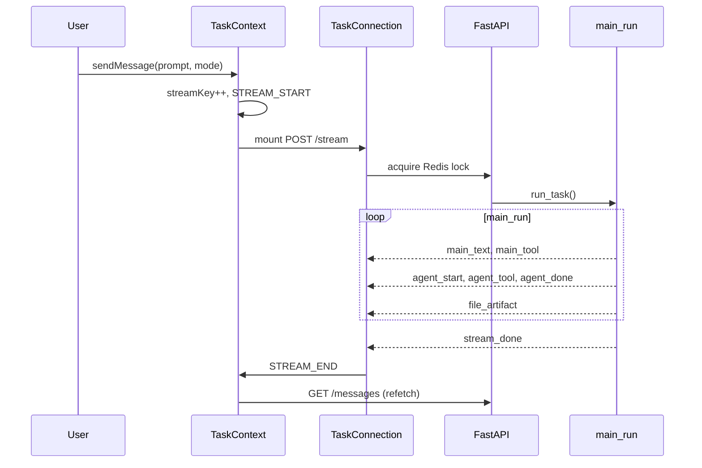
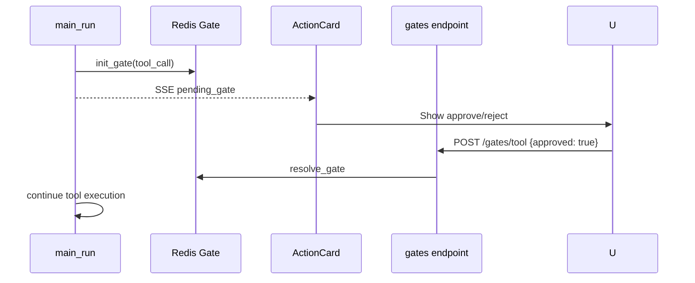
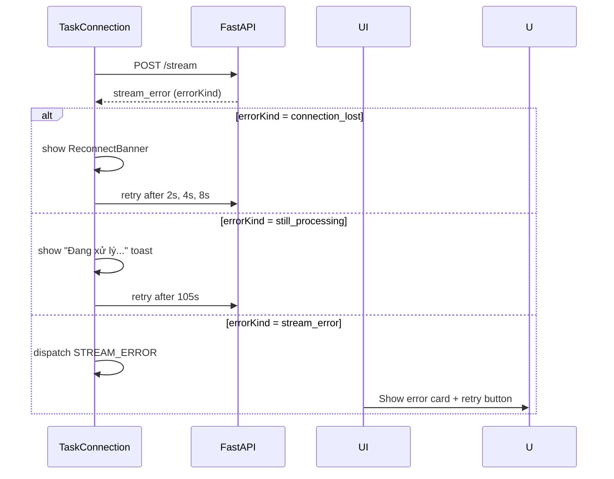

# DashZen — UI Features & Chat Agent Web App

> Tài liệu đặc tả UI/UX TypeScript (Next.js) — **v3 pre-build reference**
>
> Đây là **nguồn sự thật duy nhất** cho toàn bộ frontend Studio. Mọi quyết định UI — component, state, flow, pattern — đều ghi ở đây trước khi code.

---

## Mục lục

| § | Nội dung | Ưu tiên |
|---|----------|---------|
| [§1](#1-tổng-quan-ux--vision) | Tổng quan UX & Vision | P0 |
| [§2](#2-authentication--route-guard) | Authentication & Route Guard | P0 |
| [§3](#3-kiến-trúc-module--state-management) | Kiến trúc Module & State Management | P0 |
| [§4](#4-sidebar) | Sidebar | P0 |
| [§5](#5-chat-input) | Chat Input | P0 |
| [§6](#6-task-conversation-view) | Task Conversation View | P0 |
| [§7](#7-sse-integration-taskconnection) | SSE Integration (TaskConnection) | P0 |
| [§8](#8-dashboard-canvas--preview) | Dashboard Canvas & Preview | P1 |
| [§9](#9-ux-patterns--states) | UX Patterns & States | P0 |
| [§10](#10-ui-chi-tiết-bổ-sung) | UI Chi tiết bổ sung (streaming, reload, gates) | P1–P2 |
| [§11](#11-tech-stack-ui) | Tech Stack UI | P0 |
| [§12](#12-accessibility-a11y) | Accessibility (a11y) | P1 |
| [§13](#13-performance--optimization) | Performance & Optimization | P1 |
| [§14](#14-theme--responsive) | Theme & Responsive | P1 |
| [§15](#15-api-error-handling-strategy) | API Error Handling Strategy | P0 |
| [§16](#16-testing-strategy) | Testing Strategy | P2 |
| [§17](#17-sse-event--ui-mapping) | SSE Event → UI Mapping (full table) | P0 |
| [§18](#18-state--data-flow) | State & Data Flow (diagrams) | P0 |
| [§19](#19-mvp-vs-phase--authoritative) | MVP vs Phase — authoritative | P0 |
| [§20](#20-ui-gaps-checklist) | UI Gaps Checklist | P0 |
| [§21](#21-cross-references) | Cross-references | — |

---

## 1. Tổng quan UX & Vision

DashZen Studio là **webapp chat-first**: người dùng mô tả dashboard bằng ngôn ngữ tự nhiên, **main orchestrator** điều phối **sub-agents** phía sau, kết quả hiển thị dưới dạng **canvas preview** song song với chat.

Kiến trúc UI tham chiếu **LeadZen** (`modules/task/`): TaskContext + useReducer cho streaming, SSE client keyed remount, ActionCard cho HITL.

```
┌──────────────────────────────────────────────────────────────────┐
│ Sidebar          │  Chat Workspace          │  Canvas (optional) │
│ • New Dashboard  │  messages + agent blocks │  dashboard preview │
│ • Recents        │  input + Ask/Auto        │  live widgets      │
│ • Settings       │  context donut           │                    │
└──────────────────────────────────────────────────────────────────┘
```

### 1.1 Base features (MVP P0–P1)

Checklist tính năng **nền tảng** phải có trước khi ship MVP. Chi tiết triển khai ở các section tương ứng; scope đầy đủ xem **§19**.

#### App shell & điều hướng

| Tính năng | Mô tả | Section |
|-----------|-------|---------|
| **Authentication** | Login / Logout, JWT httpOnly cookie, refresh silent | §2 |
| **Route guard** | `/app/*` protected; `/login`, `/register` guest-only | §2.2 |
| **Sidebar** | New Dashboard, Search recents, danh sách task, Settings | §4 |
| **Layout app** | Sidebar + AuthGuard + workspace chat/canvas | §3 |
| **Routes cốt lõi** | `/app`, `/app/task/[taskId]`, `/app/dashboard/[pageId]`, `/app/settings`, `/app/profile` | §2.2 |

#### Task & chat core

| Tính năng | Mô tả | Section |
|-----------|-------|---------|
| **TaskContext + task-reducer** | State streaming chat (`useReducer` — không Zustand cho chat core) | §3.1, §7 |
| **TaskConnection (SSE)** | Gửi prompt, nhận stream events, keyed remount mỗi lần send | §7 |
| **Chat Input** | Textarea, Send, Stop; trạng thái `idle → sending → streaming → idle \| error` | §5 |
| **Ask / Auto** | Ask = Redis gate trước tool; Auto = chạy thẳng | §5 |
| **Stop stream** | `POST /v1/tasks/{id}/stop` khi agent đang chạy | §5 |
| **409 handling cơ bản** | Xử lý `still_processing` (retry đầy đủ Phase 2) | §10.5 |

#### Hiển thị hội thoại

| Tính năng | Mô tả | Section |
|-----------|-------|---------|
| **Message types cơ bản** | User bubble, assistant markdown, tool chip, error | §6.1 |
| **Agent Activity Block (basic)** | Collapsible block cho sub-agent (`agent_start` / `agent_tool` / `agent_done`) | §6.2 |
| **ActionCard (tool approval)** | HITL approve/reject tool trong Ask mode | §6.3 |
| **Dashboard Ready card** | Thông báo spec sẵn sàng + Open Preview | §6.1 |

#### Preview dashboard

| Tính năng | Mô tả | Section |
|-----------|-------|---------|
| **Canvas preview cơ bản** | Panel preview live khi có `file_artifact` / spec thay đổi | §8.1 |
| **Full-screen preview** | `/app/dashboard/[pageId]` — xem dashboard toàn màn | §8.2 |

#### Hạ tầng UI (không phải tính năng user-facing)

| Thành phần | Vai trò | Section |
|------------|---------|---------|
| **TanStack Query v5** | CRUD tasks/messages; refetch sau `STREAM_END` | §3.1, §18 |
| **Zustand** | Sidebar, theme — UI ephemeral only | §3.1 |
| **API client** | Authenticated fetch (`client.ts`, `auth.ts`, `tasks.ts`, `gates.ts`) | §3 |
| **shadcn/ui + Tailwind** | Component system | §11 |
| **Toast system** | Centralized error/success notifications | §9.2 |

#### Không thuộc base (Phase 2+)

- Context donut + manual compact
- `streamingActivities` interleaved timeline
- Regenerate / branch navigation / edit message
- `ask_user` form ActionCard (form phức tạp hơn Y/N)
- Extended thinking display đầy đủ
- File attach, Quick Action Chips (Connect Data, Template)
- Export / share, debug trace, user prefs, i18n

---

## 2. Authentication & Route Guard

### 2.1 JWT flow

```
Login → Credential Validation → Token Generation → httpOnly cookie
  → Authenticated Request → JWT Verification → Protected /app/*
```

| Bước | DashZen |
|------|---------|
| Login | `POST /v1/auth/login` → set httpOnly cookie |
| API calls | Cookie auto-send (khuyến nghị) hoặc Bearer header |
| Refresh | `POST /v1/auth/refresh` — silent, không logout đột ngột |
| Guard | `AuthGuard` + Next.js middleware |
| **JWT expiry mid-session** | Refresh tự động; nếu fail → redirect `/login` với `?return_to=` | 
| **401 trong SSE stream** | Stop stream → show session expired toast → redirect | 

### 2.2 Routes

| Route | Auth | Mô tả |
|-------|------|-------|
| `/login`, `/register` | Guest only | Redirect `/app` nếu đã login |
| `/app` | Protected | Task home — empty chat + onboarding |
| `/app/task/[taskId]` | Protected | Task conversation |
| `/app/dashboard/[pageId]` | Protected | Full-screen preview |
| `/app/settings` | Protected | Settings |
| `/app/profile` | Protected | Profile |

> Terminology: dùng **Task** (align LeadZen), không "session" hay "project" riêng trong MVP.

---

## 3. Kiến trúc Module & State Management

### 3.1 State management strategy

| Concern | Công nghệ | Ghi chú |
|---------|-----------|---------|
| **Chat streaming** | `useReducer` + TaskContext | Học LeadZen — không Zustand cho chat core |
| CRUD (tasks, messages) | TanStack Query v5 | Refetch sau `STREAM_END` |
| Sidebar, theme | Zustand | UI ephemeral state |
| SSE connection | TaskConnection component | Keyed remount mỗi send → AbortController sạch |
| **Toast / notifications** | Zustand (`useToastStore`) | Independent của chat state |
| **Rate limit awareness** | Zustand (`useRateLimitStore`) | Cache remaining counts từ response headers |

### 3.2 Module structure (LeadZen-aligned)

```
apps/studio/
├── app/
│   ├── (auth)/
│   │   ├── login/page.tsx
│   │   └── register/page.tsx
│   ├── (app)/
│   │   ├── layout.tsx                    # Sidebar + AuthGuard
│   │   ├── page.tsx                      # Home — new task + onboarding
│   │   ├── task/[taskId]/page.tsx        # Task conversation + canvas
│   │   ├── dashboard/[pageId]/page.tsx   # Full-screen preview
│   │   ├── settings/page.tsx
│   │   └── profile/page.tsx
│   └── middleware.ts
│
├── modules/task/                           # Core chat module (học LeadZen)
│   ├── contexts/
│   │   ├── task-context.tsx              # Provider: send, stop, regenerate
│   │   ├── task-reducer.ts               # Pure reducer — streaming state
│   │   └── task-connection.tsx           # SSE client, keyed remount
│   ├── hooks/                            # Custom hooks (§3.3)
│   │   ├── useTask.ts                    # sendMessage, stop, state selectors
│   │   ├── useGate.ts                    # approve/reject gate
│   │   ├── useStreamScroll.ts            # auto-scroll + scroll-to-bottom
│   │   └── useTaskMessages.ts            # TanStack Query wrapper
│   ├── components/
│   │   ├── chat/
│   │   │   ├── ChatHome.tsx              # Empty state + onboarding prompts
│   │   │   ├── ChatInput.tsx             # Ask/Auto toggle, attach, stop
│   │   │   ├── ChatMessageList.tsx       # Virtualized list
│   │   │   ├── ChatMessage.tsx           # user / assistant bubbles
│   │   │   ├── AgentActivityBlock.tsx    # collapsible sub-agent timeline
│   │   │   ├── ToolActivityChip.tsx      # tool call chip
│   │   │   ├── ActionCard.tsx            # HITL: approve/reject, ask form
│   │   │   ├── ThinkingBlock.tsx         # extended thinking (collapsible)
│   │   │   ├── ContextDonut.tsx          # % context fill
│   │   │   ├── DashboardReadyCard.tsx    # thumbnail + Open Preview
│   │   │   ├── ScrollToBottomButton.tsx  # FAB khi user scroll lên
│   │   │   └── ReconnectBanner.tsx       # SSE reconnect status bar
│   │   ├── canvas/
│   │   │   ├── DashboardCanvas.tsx       # live preview panel
│   │   │   └── WidgetRenderer.tsx
│   │   └── layout/
│   │       ├── AppSidebar.tsx
│   │       ├── SidebarRecents.tsx
│   │       └── SidebarToggle.tsx
│   └── types/
│       ├── stream-events.ts              # Mirror BE SSE types
│       └── task-state.ts
│
├── components/
│   ├── auth/
│   ├── ui/                               # shadcn/ui
│   └── shared/
│       ├── ToastContainer.tsx            # Centralized toast
│       ├── ErrorBoundary.tsx             # Generic error boundary wrapper
│       └── SkeletonLoaders.tsx           # Reusable skeleton variants
│
├── lib/
│   ├── api/
│   │   ├── client.ts                     # Authenticated fetch + error interceptor
│   │   ├── auth.ts
│   │   ├── tasks.ts                      # CRUD tasks, messages, artifacts
│   │   └── gates.ts                      # resolve tool/ask gate
│   └── stores/
│       ├── sidebarStore.ts               # Zustand — sidebar state
│       ├── themeStore.ts                 # Zustand — dark/light theme
│       ├── toastStore.ts                 # Zustand — toast queue
│       └── rateLimitStore.ts             # Zustand — rate limit awareness
│
└── types/
```

### 3.3 Custom hooks (extraction pattern)

Không để logic trong component — trích xuất vào hooks:

| Hook | Mô tả | Nguồn |
|------|-------|-------|
| `useTask()` | `sendMessage`, `stop`, `streamingState`, `pendingGate` | TaskContext |
| `useGate(gateId)` | `approve`, `reject`, gate state | TaskContext + API |
| `useStreamScroll(listRef)` | Auto-scroll khi streaming; expose `isAtBottom`, `scrollToBottom` | DOM |
| `useTaskMessages(taskId)` | TanStack Query wrapper + normalise | API |
| `useSSEConnection()` | TaskConnection mount logic | Internal |
| `useKeyboardShortcuts()` | Register/unregister shortcuts | Global listener |
| `useRateLimit()` | Read from store, format remaining | rateLimitStore |

### 3.4 Error Boundary hierarchy

```
<RootErrorBoundary>           ← crash toàn app → redirect /error
  <AuthGuard>
    <AppLayout>
      <SidebarErrorBoundary>  ← sidebar fail → ẩn sidebar, vẫn dùng chat được
      <TaskErrorBoundary>     ← task page fail → show retry
        <CanvasErrorBoundary> ← canvas fail → ẩn canvas, chat vẫn ok
          <WidgetErrorBoundary per widget> ← widget fail → hiện placeholder
```

Nguyên tắc: **fail locally, không crash globally**.

---

## 4. Sidebar

| Item | Hành vi |
|------|---------|
| **New Dashboard** | `POST /v1/tasks` → navigate `/app/task/{id}` |
| **Search** | Filter recents (debounced 300ms); Cmd+K phase 2 |
| **Recents** | `GET /v1/tasks` — title, status icon, relative time |
| **Settings** | `/app/settings` |

**Recents item:**

- [ ] Title (auto từ prompt đầu hoặc `task_meta` SSE event)
- [ ] Status: `draft` / `streaming` / `ready` / `error` — icon + màu
- [ ] Context menu (right-click / kebab): Rename, Delete, Duplicate (phase 2)
- [ ] Click → `/app/task/[taskId]`
- [ ] Skeleton loading khi fetch recents lần đầu
- [ ] **Empty state:** *"Chưa có dashboard nào — bắt đầu bằng một prompt bên dưới"* + cta button

**Sidebar states:**

| State | UI |
|-------|-----|
| Loading | Skeleton 3–5 items |
| Empty | Empty state CTA |
| Error (network) | Retry button |
| Collapsed (mobile) | Icon-only; hover tooltip |

---

## 5. Chat Input

```
┌─────────────────────────────────────────────────────────┐
│  Mô tả dashboard bạn muốn tạo...                        │
│                                                         │
│  📎  ⚡ Auto          ~120 tokens           [ ↑ Send ]  │
│  ████████████████░░░░  [Stop ◼]                        │
└─────────────────────────────────────────────────────────┘
```

| Thành phần | Chức năng |
|------------|-----------|
| **Textarea** | Auto-resize (max 6 rows); `Shift+Enter` newline; `Enter` send |
| **📎 Attach** | CSV, JSON schema — `ensureTask()` trước upload (phase 2) |
| **⚡ Ask / Auto** | **Ask**: Redis gate trước tool; **Auto**: chạy thẳng |
| **Token estimate** | ~N tokens — ước tính từ `tokens_per_char` (phase 2, align §8.4 plan-01) |
| **↑ Send** | Disabled khi empty hoặc đang stream |
| **Stop ◼** | `POST /v1/tasks/{id}/stop` — hiện khi streaming, ẩn khi idle |
| **Drag & drop** | Drop CSV/file vào textarea area → attach (phase 2) |

**Input states:** `idle` → `sending` → `streaming` → `idle` | `error`

- `idle`: Send enabled nếu có text
- `sending`: Send disabled, spinner nhỏ
- `streaming`: Stop button visible, Send hidden, textarea disabled
- `error`: Input re-enabled; last content giữ nguyên để retry

**Focus management:**
- Auto-focus textarea khi mount task view
- Sau khi gửi message → focus lại textarea
- Khi `STREAM_END` → focus textarea

### 5.1 Quick Action Chips (Home / Empty state)

| Chip | Hành vi |
|------|---------|
| **Design Dashboard** | Prefill template + `set_memory({type: dashboard})` hint |
| **Connect Data** | Modal upload CSV (phase 2) |
| **From Template** | Gallery (phase 2) |

Click chip → prefill input, **không gửi ngay**.

---

## 6. Task Conversation View (`/app/task/[taskId]`)

### 6.1 Message types

| Loại | Hiển thị | SSE source |
|------|----------|------------|
| **User** | Bubble phải, avatar | Optimistic + DB |
| **Assistant** | Bubble trái, markdown rendered | `main_text` deltas |
| **Thinking** | Collapsible muted block, icon 🧠 | `main_think` |
| **Tool chip** | Inline chip + status icon + result expandable | `main_tool` / `main_result` |
| **Agent block** | Collapsible card, timeline bên trong | `agent_*` events |
| **Action card** | Y/N approve hoặc form | `main_ask`, pending gate |
| **Dashboard ready** | Rich card + thumbnail + Open Preview | `file_artifact` + spec ready |
| **Error** | Red alert + retry button | `stream_error` |
| **Rate limited** | Warning card + cooldown timer | HTTP 429 |

**Message metadata (hiện khi hover):**
- Timestamp (relative → absolute on hover)
- Copy button (copy markdown content)
- Regenerate button (assistant messages — phase 2)

**Markdown rendering:**
- Library: `react-markdown` + `remark-gfm`
- Code syntax highlighting: `shiki` (lightweight, tree-shakable)
- Tables, task lists, strikethrough enabled via remark-gfm
- Links: `target="_blank" rel="noopener noreferrer"` + external icon

**Scroll behavior:**
- Auto-scroll to bottom khi nhận streaming delta (`useStreamScroll`)
- Nếu user scroll lên → dừng auto-scroll
- `ScrollToBottomButton` FAB hiện khi `!isAtBottom`
- Sau `STREAM_END` → scroll về cuối

### 6.2 Agent Activity Block (sub-agent UI)

Mỗi `spawn_agent` render một collapsible block — học LeadZen:

```
┌─ Dashboard Planner ──────────────────── ▼ ─┐
│  ✓ read_file spec-template.md            │
│  ✓ write_file spec.md                    │
│  ● search_components "bar chart"  ···    │
│  Summary: Created spec with 4 widgets... │
└──────────────────────────────────────────┘
```

- [ ] `agent_start` → mở block, hiện displayName + spinner
- [ ] `agent_tool` / `agent_result` → timeline entries với status icons
- [ ] `agent_text` → stream text trong block (không mix vào main bubble)
- [ ] `agent_done` → collapse + summary, spinner → checkmark/error icon
- [ ] Reload từ `AgentRun.activities` JSON khi refresh page

**Agent block states:** `running` | `done` | `error` | `collapsed`

### 6.3 Human-in-the-loop (MVP — không defer)

| Pattern | UI component | API |
|---------|--------------|-----|
| Tool approval (Ask mode) | `ActionCard` Y/N | `POST /gates/tool` |
| `ask_user` form | `ActionCard` input fields | `POST /gates/ask` |
| Data connector approval | `ActionCard` + mô tả connector | Tool gate |

Flow: SSE emit pending → reducer set `pendingGate` → user resolve → stream resume.

**ActionCard UI:**
- Blocked state: dimmed input + spinner trong "Waiting for your approval"
- After approve: green check + "Approved, continuing…"
- After reject: red x + "Rejected" + agent response
- Timeout (5 min): warning toast + auto-reject option (phase 2)

### 6.4 Context Donut

- [ ] Hiển thị % context fill (shared `GET /v1/llm/budget` + token count từ task)
- [ ] Nút **Compact** khi > 50% threshold (`isCompactEligible`)
- [ ] `POST /v1/tasks/{id}/compact` → refetch messages
- [ ] Tooltip: "Context X% full — compact để tối ưu"

### 6.5 ReconnectBanner

Hiện khi SSE bị ngắt (network issue, server restart):

```
┌────────────────────────────────────────────────────────┐
│ ⚠  Mất kết nối — đang thử kết nối lại...  [Thử lại]  │
└────────────────────────────────────────────────────────┘
```

- Auto-retry với exponential backoff (§10.5)
- Biến mất khi reconnect thành công
- Nếu agent vẫn chạy trong khi mất kết nối → hiện "Agent đang chạy..."

---

## 7. SSE Integration (TaskConnection)

### 7.1 Client pattern (học LeadZen)

```typescript
// Mỗi sendMessage tăng streamKey → remount TaskConnection
<TaskConnection
  key={streamKey}
  taskId={taskId}
  body={streamRequest}
  onEvent={dispatch}      // → taskReducer
  onEnd={() => refetchMessages()}
/>
```

`TaskConnection` là **React component** (không phải hook) → key-remount khi gửi message mới → AbortController sạch tự nhiên qua unmount lifecycle.

### 7.2 Complete Reducer Actions (authoritative — single source)

| Reducer Action | SSE / Trigger | UI Effect |
|----------------|---------------|-----------|
| `STREAM_START` | sendMessage | Optimistic user msg, disable input |
| `STREAM_DELTA` | `main_text` | Append/interleave assistant text |
| `STREAM_THINKING_DELTA` | `main_think` | Append thinking block |
| `TOOL_PENDING` | gate init (pre-execute) | ActionCard Y/N (tool approval) |
| `TOOL_START` | `main_tool` | Tool chip running |
| `TOOL_RESULT` | `main_result` | Tool chip done + result cache |
| `ASK_PENDING` | `main_ask` | ActionCard form |
| `ASK_SUBMITTED` | user submit | Hide form, show submitted state |
| `TOOL_DECISION` | gate resolved | Inject feedback, resume |
| `AGENT_START` | `agent_start` | Open agent activity block |
| `AGENT_EVENT` | `agent_text/tool/result` | Update block timeline |
| `AGENT_DONE` | `agent_done` | Collapse + summary |
| `STREAM_ARTIFACT` | `file_artifact` | Update canvas |
| `SET_TASK_META` | `task_meta` | Sidebar title update |
| `SET_TIP` | branch API | Branch navigation hint |
| `STREAM_END` | `stream_done` | Bridge state → refetch |
| `STREAM_ERROR` | `stream_error` | Error + retry |
| `SET_MESSAGES` | refetch complete | Replace streaming → DB messages |
| `REMOVE_MESSAGE` | edit/regenerate fork | Remove forked msg |
| `RESET` | navigate away | Clear task state |

> `TOOL_PENDING` **không** có SSE event riêng — reducer trigger từ stream handler khi detect gate init.

### 7.3 Reconnect behavior

- [ ] Client disconnect → backend tiếp tục (không abort — §12.3 plan-01)
- [ ] User quay lại → `GET /messages` + `GET /artifacts` restore state
- [ ] Nếu vẫn streaming → hiện `ReconnectBanner` + optional reconnect SSE
- [ ] Read stall (35s không data) → `connection_lost` error kind

### 7.4 TaskConnection resilience

| Pattern | Chi tiết |
|---------|----------|
| Keyed remount | `key={streamKey}` mỗi send — AbortController sạch |
| Pre-stream retry | 2× retry nếu connection fail trước first byte |
| Read stall | Abort + `connection_lost` sau 35s không có data |
| 409 handling | `still_processing` → auto-retry sau 105s |
| `errorKind` | `still_processing` \| `connection_lost` \| `stream_error` — UI khác nhau |
| Stop before send | Await `stopInFlightRef` trước stream mới — tránh 409 race |

---

## 8. Dashboard Canvas & Preview

### 8.1 Split view (`/app/task/[taskId]`)

```
┌─ Chat (60%) ──────────────┬─ Canvas (40%) ─────────────┐
│ messages...               │  [KPI] [KPI] [KPI]         │
│                           │  [Chart────] [Table──]     │
│ input...                  │  live update on file_artifact│
└───────────────────────────┴────────────────────────────┘
```

- [ ] Canvas toggle — mở/đóng panel phải (persist state trong localStorage)
- [ ] `file_artifact` SSE → hot-reload preview khi `spec.md` / widgets thay đổi
- [ ] Responsive toggle buttons: Desktop / Tablet / Mobile preview
- [ ] **Resize handle** giữa chat và canvas (drag để điều chỉnh tỷ lệ)
- [ ] Canvas lazy mount — chỉ render khi có `file_artifact`

### 8.2 Full-screen preview (`/app/dashboard/[pageId]`)

- [ ] Toolbar: Back to task, Export (phase 3), View code (phase 2)
- [ ] **Continue in chat** → navigate `/app/task/{taskId}` gắn với page
- [ ] Error boundary per widget → widget fail hiện placeholder, không crash page
- [ ] Print-friendly CSS (phase 3)

---

## 9. UX Patterns & States

### 9.1 Loading States & Skeleton

Mỗi component có skeleton riêng, không dùng spinner toàn trang:

| Component | Loading UI |
|-----------|------------|
| `SidebarRecents` | 3–5 skeleton lines (title + meta) |
| `ChatMessageList` | 2–3 skeleton bubbles (user + assistant) |
| `AgentActivityBlock` | Spinner + "Loading activity…" |
| `DashboardCanvas` | Skeleton grid với KPI/chart placeholders |
| `DashboardReadyCard` | Thumbnail skeleton |
| `ContextDonut` | Circle skeleton |

**Progressive loading:**
- Messages load → skeleton → real content (no layout shift)
- Canvas load → skeleton → real widgets

### 9.2 Error States & Toast System

**Centralized toast system** (Zustand `useToastStore`):

```typescript
type Toast = {
  id: string;
  type: 'success' | 'error' | 'warning' | 'info';
  title: string;
  description?: string;
  duration?: number;   // default 4000ms; 0 = persistent
  action?: { label: string; onClick: () => void };
};
```

| Trigger | Toast |
|---------|-------|
| Stream error | Error toast + retry action |
| 401 JWT expired | Warning + "Đăng nhập lại" action |
| 429 rate limited | Warning + cooldown time |
| 500 server error | Error + "Thử lại sau" |
| Network offline | Persistent warning (dismiss khi online) |
| Task deleted elsewhere | Warning toast |
| Compact success | Success toast |
| Copy message | Success toast "Đã sao chép" |

**Error component levels (theo §3.4 boundary hierarchy):**

| Level | Error UI |
|-------|----------|
| Widget | Inline placeholder "Widget không tải được" + retry |
| Canvas | Banner trong canvas panel |
| Task page | Centered error card + retry button |
| App shell | Full page error với support contact |

### 9.3 Empty States

| Screen | Empty state UI |
|--------|----------------|
| `ChatHome` (no tasks) | Illustration + "Tạo dashboard đầu tiên của bạn" + quick action chips |
| `SidebarRecents` (no tasks) | Text: "Chưa có dashboard nào" |
| `ChatMessageList` (new task) | Welcome message từ agent + example prompts |
| `DashboardCanvas` (no artifact yet) | Placeholder: "Dashboard preview sẽ hiện ở đây" |
| Settings (no custom instructions) | Placeholder text |

### 9.4 Optimistic Updates

| Action | Optimistic behavior |
|--------|---------------------|
| Send message | User bubble hiện ngay (trước khi confirm từ DB) |
| Delete task | Task biến khỏi sidebar ngay, rollback nếu lỗi |
| Rename task | Title update ngay, rollback nếu lỗi |
| Gate approve/reject | ActionCard close ngay, stream resume indicator |

### 9.5 Scroll Behavior

```typescript
// useStreamScroll hook
const { listRef, isAtBottom, scrollToBottom } = useStreamScroll();

// Logic:
// - Nếu isAtBottom: auto-scroll khi nhận STREAM_DELTA
// - Nếu user cuộn lên: tắt auto-scroll, hiện ScrollToBottomButton
// - Khi click ScrollToBottomButton: scroll + bật lại auto-scroll
// - Khi STREAM_END: scroll về cuối nếu không phải user đang đọc lại
```

---

## 10. UI Chi tiết bổ sung

### 10.1 `streamingActivities` (interleaved timeline)

Thay vì flat text bubble, assistant message render **interleaved blocks**:

```
[text chunk] [thinking block] [tool chip] [text chunk] [agent block] ...
```

- Tránh flicker khi tool chèn giữa text stream
- `task-reducer` giữ `streamingActivities[]` trong suốt stream
- `STREAM_END` → bridge giữ streaming state cho đến `SET_MESSAGES` (no layout jump)

### 10.2 Message reload (`normalise_messages`)

Khi refresh page hoặc `STREAM_END` refetch:

- [ ] `GET /messages` → `normaliseMessages()` pure function
- [ ] `reconstructAgentCalls()` — rebuild `AgentActivityBlock` từ `AgentRun.activities`
- [ ] `thinkingByMessageId` map — restore thinking blocks
- [ ] `toolResults` session cache — backfill chip results (DB không lưu full tool rows cho display)
- [ ] Compact boundary — ẩn messages trước `role: compact` node

### 10.3 Gate routing cho sub-agent

- [ ] `gateToAgentId` map — `TOOL_PENDING` route ActionCard vào đúng agent block (ask mode + sub-agent tools)
- [ ] Gate feedback text hiển thị trong tool chip sau approve/reject

### 10.4 Regenerate & branch navigation (Phase 2 — không defer Phase 3)

| Feature | API | UI |
|---------|-----|-----|
| Regenerate | Fork message tree + new stream | Nút ↻ trên assistant message (hover) |
| Edit message | Fork từ user message + edited content | Inline edit → resend |
| Branch nav | `branchInfo` từ `GET /messages` | `‹ 2/3 ›` trên message có siblings |
| `SET_TIP` | SSE hoặc API | Hint khi có nhánh mới |

### 10.5 TaskConnection resilience (detail — xem §7.4 overview)

- `errorKind` phân biệt: `still_processing` | `connection_lost` | `stream_error`
- Mỗi error kind → UI khác nhau (toast message + action khác nhau)

### 10.6 Attach-before-first-send

- [ ] `ensureTask()` — tạo task trước khi upload nếu chưa có taskId
- [ ] Upload → `persistUploadFiles` link vào pending user message khi stream start

### 10.7 User preferences (Phase 3)

| Pref | Storage | UI |
|------|---------|-----|
| `default_mode` | Account + localStorage per task | Ask/Auto toggle default |
| `default_thinking` | Account | Settings toggle |
| `custom_instructions` | Account | Settings textarea → `# USER` block |
| `language` | Account | Settings |

---

## 11. Tech Stack UI

| Layer | Công nghệ | Ghi chú |
|-------|-----------|---------|
| Framework | **Next.js 15** App Router | SSR + RSC |
| Language | **TypeScript 5.x** strict | `"strict": true` trong tsconfig |
| Styling | **Tailwind CSS 4** | CSS variables cho theme |
| Components | **shadcn/ui** + Radix | Copy-paste approach |
| Icons | **lucide-react** | Consistent icon set |
| Forms | **react-hook-form** + **zod** | Validation, login, settings, ask forms |
| Server state | **TanStack Query v5** | Cache, refetch, optimistic |
| Chat streaming state | **useReducer** (TaskContext) | Complex async state machine |
| UI ephemeral state | **Zustand** | Sidebar, theme, toast, rate limit |
| Streaming transport | **fetch ReadableStream** (SSE) | Native, no lib needed |
| Auth | Custom JWT + httpOnly cookie | better-auth phase 2 |
| Markdown render | **react-markdown** + **remark-gfm** | Tables, task lists, strike |
| Code highlight | **shiki** | Tree-shakable, theming |

---

## 12. Accessibility (a11y)

**Target:** WCAG 2.1 AA

### 12.1 Keyboard Navigation

| Shortcut | Action |
|----------|--------|
| `Enter` | Send message (trong textarea) |
| `Shift+Enter` | Newline trong textarea |
| `Escape` | Cancel streaming (nếu đang stream) / Close modal |
| `Tab` | Navigate giữa ActionCard buttons (approve / reject) |
| `Space` / `Enter` | Activate buttons / collapse toggles |
| `Cmd+/` | Toggle sidebar (phase 2) |
| `Cmd+K` | Command palette (phase 2) |

### 12.2 ARIA & Screen Reader

| Component | ARIA |
|-----------|------|
| `ChatMessageList` | `role="log"` + `aria-live="polite"` cho streaming |
| Streaming text | `aria-live="assertive"` trong bubble khi đang stream |
| `AgentActivityBlock` | `role="region"` + `aria-expanded` |
| `ActionCard` | `role="dialog"` + focus trap khi mở |
| `ContextDonut` | `role="progressbar"` + `aria-valuenow` |
| `ScrollToBottomButton` | `aria-label="Cuộn xuống tin nhắn mới nhất"` |
| Toast | `role="alert"` + `aria-atomic` |
| Loading skeletons | `aria-busy="true"` trên container |

### 12.3 Color & Contrast

- Không dùng màu duy nhất để truyền thông tin (dùng thêm icon/text)
- Error states: màu đỏ + icon + text
- Status icons: màu + shape khác nhau (`✓` `●` `✗`)
- Focus rings: outline rõ ràng, không bị hide

### 12.4 Motion

- Respect `prefers-reduced-motion` — tắt animations cho streaming text
- Fade transitions thay vì slide cho users nhạy cảm với motion

---

## 13. Performance & Optimization

### 13.1 Virtualized Message List

- [ ] Dùng `@tanstack/react-virtual` cho `ChatMessageList`
- [ ] Overscan 3 items
- [ ] Dynamic height per message (estimated rồi measure)
- [ ] Không virtualize khi < 20 messages (overhead không đáng)

### 13.2 Memoization Strategy

| Component | Memoize bằng |
|-----------|-------------|
| `ChatMessage` | `React.memo` — chỉ re-render khi message thay đổi |
| `AgentActivityBlock` | `React.memo` + `useMemo` cho timeline |
| `DashboardCanvas` | `React.memo` — chỉ re-render khi `artifactUrl` thay đổi |
| `SidebarRecents item` | `React.memo` |
| Reducer selectors | `useCallback` / `useMemo` trong context |

### 13.3 Code Splitting & Lazy Loading

```typescript
// Canvas panel — lazy load, chỉ dùng khi có artifact
const DashboardCanvas = lazy(() => import('./canvas/DashboardCanvas'));

// Full-screen preview — separate route chunk tự động (Next.js App Router)
// Settings page — lazy load, ít dùng
const SettingsPage = lazy(() => import('./settings/page'));
```

### 13.4 Bundle & Asset Optimization

- `shiki` — chỉ import ngôn ngữ cần thiết (typescript, python, json, markdown)
- Tailwind CSS 4 — purge tự động
- Images: Next.js `<Image>` với `lazy` + srcset
- Fonts: `next/font` với `display: swap`

### 13.5 Network Performance

- TanStack Query: `staleTime: 30_000` cho task list
- Prefetch task khi hover sidebar item (phase 2)
- Artifact cache: nếu `file_artifact` event có cùng hash → không reload canvas

---

## 14. Theme & Responsive

### 14.1 Theme System

**Dark / Light mode via CSS variables + Zustand:**

```typescript
// themeStore.ts
type Theme = 'light' | 'dark' | 'system';
const useThemeStore = create<{ theme: Theme; setTheme: (t: Theme) => void }>();
```

- Persist trong `localStorage`
- `system`: theo `prefers-color-scheme`
- Apply via `document.documentElement.classList` ('dark') — Tailwind dark mode class strategy
- shadcn/ui tokens tự adapt

### 14.2 Responsive Breakpoints

| Breakpoint | Layout |
|------------|--------|
| `< 768px` (mobile) | Sidebar ẩn → hamburger menu; chat full width; canvas = separate tab/route |
| `768px–1024px` (tablet) | Sidebar collapsible icon-only; canvas toggle |
| `> 1024px` (desktop) | Full 3-column layout |

**Mobile considerations:**
- Chat input sticky bottom (safe-area-inset-bottom cho iOS)
- Touch-friendly hit targets (min 44×44px)
- Canvas preview → link to full-screen route thay vì split view

### 14.3 Canvas Responsive Preview

Trong canvas panel, có toolbar chọn viewport:

```
[🖥 Desktop] [📱 Tablet] [📲 Mobile]
```

- Resize canvas iframe/container theo breakpoint được chọn
- Persist chọn trong localStorage

---

## 15. API Error Handling Strategy

### 15.1 HTTP Error Classification

| Status | Handling |
|--------|----------|
| `400` | Inline form error (validation) |
| `401` | Auto-refresh token; nếu fail → redirect `/login?return_to=` |
| `403` | Toast "Không có quyền thực hiện" |
| `404` | Redirect về home hoặc inline "Không tìm thấy" |
| `409` (`still_processing`) | SSE: auto-retry sau 105s; REST: toast + disable button |
| `429` | Toast warning + hiện cooldown timer; cập nhật `rateLimitStore` |
| `500` / `503` | Toast error + retry button; log error ID nếu có |
| Network offline | Persistent offline toast; pause polling |

### 15.2 API Client Error Interceptor

```typescript
// lib/api/client.ts
async function fetchWithAuth(url, options) {
  const res = await fetch(url, { ...options, credentials: 'include' });
  
  if (res.status === 401) {
    const refreshed = await tryRefreshToken();
    if (!refreshed) { redirectToLogin(); return; }
    return fetchWithAuth(url, options); // retry once
  }
  
  if (res.status === 429) {
    const retryAfter = res.headers.get('Retry-After');
    useRateLimitStore.getState().setRateLimit(url, retryAfter);
    throw new RateLimitError(retryAfter);
  }
  
  if (!res.ok) throw new ApiError(res.status, await res.json());
  return res;
}
```

### 15.3 Rate Limit UI

- `rateLimitStore` track remaining counts từ response headers (`X-RateLimit-Remaining`)
- Dashboard creation limit: hiện "X/20 dashboard hôm nay" trong sidebar (phase 2)
- Khi hit limit: disable "New Dashboard" button + tooltip với thời gian reset

### 15.4 SSE Error Handling

Xem `errorKind` §10.5:

| `errorKind` | UI |
|-------------|-----|
| `stream_error` | Red error card trong chat + "Thử lại" button |
| `connection_lost` | `ReconnectBanner` + auto-retry |
| `still_processing` | Yellow warning + "Đang xử lý, vui lòng chờ..." + auto-retry |

---

## 16. Testing Strategy

### 16.1 Test Pyramid

| Layer | Tool | Coverage target | Ưu tiên |
|-------|------|-----------------|---------|
| Unit (pure functions) | **Vitest** | `task-reducer`, `normaliseMessages`, `reconstructAgentCalls` | P1 |
| Component | **Testing Library** | ChatInput, ActionCard, AgentActivityBlock | P2 |
| Integration (hook) | **Testing Library + MSW** | `useTask`, SSE flow mock | P2 |
| E2E | **Playwright** | Happy path: login → send → stream → canvas | P3 |

### 16.2 Critical Test Cases

**task-reducer (pure function — 100% unit tested):**
- [ ] `STREAM_START` → optimistic message
- [ ] `STREAM_DELTA` → append text
- [ ] `PENDING_GATE` → show ActionCard
- [ ] `GATE_RESOLVED` → hide ActionCard
- [ ] `STREAM_END` → transition to refetch state
- [ ] `STREAM_ERROR` → error state + enable input

**SSE flow integration:**
- [ ] Send → receive delta → display streaming text
- [ ] 409 → auto-retry flow
- [ ] Disconnect → reconnect → restore state

### 16.3 Mock Strategy

- **MSW** (Mock Service Worker): mock REST + SSE endpoints
- SSE mock: `ReadableStream` với `TextEncoder` để test streaming reducer
- TaskContext: wrap trong test provider với custom initial state

---

## 17. SSE Event → UI Mapping (full)

| SSE Event | Reducer Action | UI Effect |
|-----------|----------------|-----------|
| `heartbeat` | (ignore) | Keep-alive only — không dispatch |
| `main_text` | `STREAM_DELTA` | Interleaved text append |
| `main_think` | `STREAM_THINKING_DELTA` | Thinking block |
| `main_tool` | `TOOL_START` | Tool chip running |
| `main_result` | `TOOL_RESULT` | Tool chip done |
| `main_ask` | `ASK_PENDING` | ActionCard form |
| `agent_start` | `AGENT_START` | Agent block open |
| `agent_text` | `AGENT_EVENT` | Text in block |
| `agent_think` | `AGENT_EVENT` | Thinking in block |
| `agent_tool` | `AGENT_EVENT` | Timeline entry |
| `agent_result` | `AGENT_EVENT` | Timeline result |
| `agent_done` | `AGENT_DONE` | Summary + collapse |
| `file_artifact` | `STREAM_ARTIFACT` | Canvas hot-reload |
| `task_meta` | `SET_TASK_META` | Sidebar title update |
| `stream_done` | `STREAM_END` | Bridge → refetch |
| `stream_error` | `STREAM_ERROR` | Error alert + retry |

> Gate events: `TOOL_PENDING` emit **trước** tool execute (không có SSE event riêng — reducer trigger từ stream handler khi detect gate).

---

## 18. State & Data Flow

### 18.1 Chat stream flow



### 18.2 HITL gate flow



### 18.3 Error recovery flow



---

## 19. MVP vs Phase — authoritative

> Đây là **nguồn sự thật duy nhất** cho scope. Xem §1.1 cho checklist đầy đủ tính năng base.

### MVP (P0–P1) — phải ship

- [ ] Login / Logout / Auth guard / Route protection
- [ ] Sidebar: New Dashboard, Recents (với skeleton + empty state)
- [ ] TaskContext + task-reducer (subset actions §7.2 đủ cho MVP)
- [ ] TaskConnection SSE + Stop + 409 handling cơ bản
- [ ] Chat Input: Ask/Auto toggle, Send, Stop
- [ ] Message types: User, Assistant (markdown), Tool chip, Error
- [ ] ActionCard: Y/N tool approval (Ask mode)
- [ ] Agent Activity Block basic (open/timeline/close)
- [ ] Dashboard Ready card
- [ ] Canvas preview basic (split view)
- [ ] Toast system (error + success cơ bản)
- [ ] Scroll-to-bottom behavior
- [ ] Error boundaries (TaskErrorBoundary + WidgetErrorBoundary)
- [ ] Skeleton loaders cho Sidebar và MessageList
- [ ] Empty states cho ChatHome và Sidebar
- [ ] JWT 401 handling + redirect

### Phase 2 — promote từ Phase 3 (quan trọng cho core UX)

- [ ] `streamingActivities` interleaved timeline
- [ ] `STREAM_END` bridge + `normalise_messages`
- [ ] Context donut + manual compact
- [ ] Extended thinking display đầy đủ
- [ ] Regenerate + branch navigation
- [ ] `ask_user` form ActionCard (phức tạp hơn Y/N)
- [ ] TaskConnection retry + `errorKind` đầy đủ
- [ ] ReconnectBanner + reconnect flow
- [ ] Split view canvas (resize handle)
- [ ] File attach + `ensureTask`
- [ ] `ScrollToBottomButton` (FAB)
- [ ] Virtualized message list
- [ ] Rate limit UI + awareness
- [ ] Keyboard shortcuts (Escape, Cmd+/)
- [ ] Canvas responsive preview toggle
- [ ] Copy message button
- [ ] Token estimate trong input

### Phase 3 — nice-to-have

- [ ] Export / share dashboard
- [ ] Debug trace panel
- [ ] User prefs (`custom_instructions`, defaults)
- [ ] i18n VI/EN
- [ ] Invite gate / email verification (nếu multi-user)
- [ ] Command palette (Cmd+K)
- [ ] Template gallery
- [ ] Onboarding tour (interactive)
- [ ] Favorite / bookmark dashboard
- [ ] Print-friendly preview

---

## 20. UI Gaps Checklist (đối chiếu LeadZen + pre-build audit)

| Gap | Trạng thái plan | Action |
|-----|------------------|--------|
| `streamingActivities` interleaved | Đã bổ sung §10.1 | Implement Phase 2 |
| `normalise_messages` reload | Đã bổ sung §10.2 | Implement Phase 2 |
| `gateToAgentId` sub-agent gates | Đã bổ sung §10.3 | Implement với Ask mode |
| TaskConnection retry/stall | Đã bổ sung §7.4 | Implement Phase 2 |
| Regenerate / branch nav | Promote Phase 2 §10.4 | Không defer Phase 3 |
| `heartbeat` SSE handling | Đã bổ sung §17 | FE ignore |
| Context donut REST vs shared import | Dùng `GET /v1/llm/budget` | Align plan-01 §10.10 |
| Auth better-auth vs JWT | Documented plan-01 §10.11 | MVP = JWT |
| **Accessibility a11y** | **Đã bổ sung §12** | Implement P1 |
| **Performance / virtualization** | **Đã bổ sung §13** | Implement Phase 2 |
| **Toast system** | **Đã bổ sung §9.2** | Implement MVP |
| **Error boundary hierarchy** | **Đã bổ sung §3.4** | Implement MVP |
| **Scroll behavior** | **Đã bổ sung §9.5** | Implement MVP |
| **Empty states** | **Đã bổ sung §9.3** | Implement MVP |
| **Skeleton loaders** | **Đã bổ sung §9.1** | Implement MVP |
| **API error interceptor** | **Đã bổ sung §15** | Implement MVP |
| **Rate limit UI** | **Đã bổ sung §15.3** | Implement Phase 2 |
| **Testing strategy** | **Đã bổ sung §16** | Implement Phase 2+ |
| **Custom hooks extraction** | **Đã bổ sung §3.3** | Implement MVP |
| **Markdown + code highlight libs** | **Đã bổ sung §11** | Implement MVP |
| **Theme system** | **Đã bổ sung §14** | Implement P1 |
| **Responsive breakpoints** | **Đã bổ sung §14.2** | Implement P1 |
| **ReconnectBanner** | **Đã bổ sung §6.5** | Implement Phase 2 |
| **Focus management** | **Đã bổ sung §5** | Implement MVP |
| `spawn_task` multi-task | Out of scope MVP | Optional Phase 3 |

---

## 21. Cross-references

| File | Nội dung liên quan |
|------|--------------------|
| `01-project-structure-and-techstack.md` | System-of-systems §3, subsystem catalog §4–14, SSE schema §12, rate limits §12.4 |
| `03-agent-runtime-and-memory.md` | main_run, recovery, gates FSM, title generation |
| `04-dashboard-spec-schema.md` | Schema `DashboardSpec` cho `WidgetRenderer` |
| `05-mvp-scope.md` | Chốt scope — dùng gap audit để promote/demote |
| `06-api-contracts.md` | OpenAPI + SSE schema full + branching + rate limit headers |

---

## Wireframe tham chiếu (full view)

```
┌─ Sidebar ─────────┬─ Chat ─────────────────────────────┬─ Canvas ──────┐
│ DashZen        [≡]│                                    │ [KPI][KPI]    │
│                   │  User: Tạo dashboard doanh thu...  │               │
│ ⊕ New Dashboard   │                                    │ [Chart───]    │
│ 🔍 Search         │  ┌─ Dashboard Planner ─────── ▼ ─┐ │               │
│                   │  │ ✓ read_file spec-template.md   │ │               │
│ RECENTS           │  │ ✓ write_file spec.md           │ │               │
│ ● Sales Q1        │  │ Summary: 4 widgets...          │ │               │
│   Revenue dash    │  └────────────────────────────────┘ │               │
│                   │                                    │               │
│                   │  [Dashboard Ready ✓ → Open ↗]     │               │
│                   │                                    │               │
│                   │  ┌─────────────────────────────┐  │               │
│ ⚙ Settings        │  │ prompt...  📎 ⚡Auto  ↑Send │  │               │
│                   │  └─────────────────────────────┘  │               │
│                   │  ○○○○ 42% context  [Compact]       │               │
└───────────────────┴────────────────────────────────────┴───────────────┘
```
