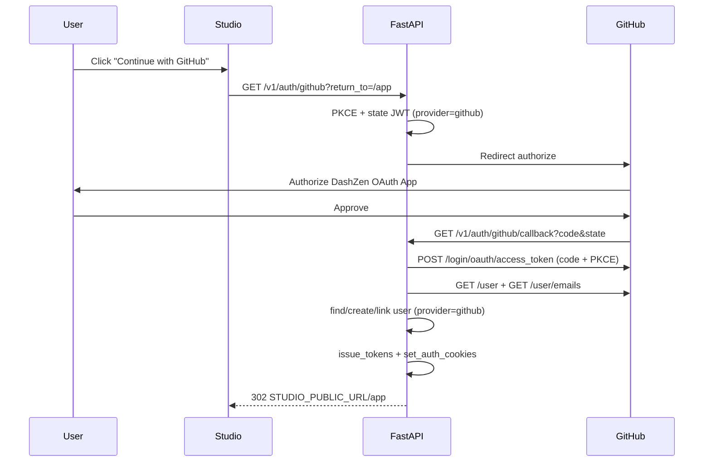

# GitHub OAuth Login — Master Plan

> **Tính năng:** Đăng nhập / đăng ký bằng GitHub cho DashZen Studio.
>
> **Trạng thái:** Planned
>
> **Ngày lập:** 2026-06-27
>
> **Tiền đề:** Google OAuth **Done** — [`google-oauth-login.md`](./google-oauth-login.md)
>
> **Chi tiết triển khai:**
> - Backend → [`phases/Backend/auth/10-github-oauth.md`](./phases/Backend/auth/10-github-oauth.md)
> - Frontend → [`phases/UI/Auth/12-github-oauth.md`](./phases/UI/Auth/12-github-oauth.md)
> - Checklist → [`phases/Backend/auth/11-github-oauth-checklist.md`](./phases/Backend/auth/11-github-oauth-checklist.md)

---

## 1. Tóm tắt

DashZen đã có:

- Auth email/password + OTP
- **Google OAuth** (BFF, PKCE, `oauth_accounts`, httpOnly cookies) — **Done**
- Bảng `oauth_accounts` với `UNIQUE(provider, provider_subject)` — **sẵn sàng cho GitHub**

GitHub login sẽ **mirror Google** về kiến trúc: backend xử lý OAuth, set JWT cookies, redirect về Studio. **Không cần migration DB mới.**

### Mục tiêu sản phẩm

| Mục tiêu | Mô tả |
|----------|-------|
| Dev-friendly signup | Dev/user GitHub phổ biến trong target audience |
| Tái sử dụng infra | Cùng `oauth_accounts`, cookies, `issue_tokens()` |
| An toàn | Authorization Code + **PKCE** + signed `state` JWT |
| Multi-provider | User có thể link cả Google + GitHub (cùng email) |
| Prod-ready | Render + Vercel `/api` proxy giống Google |

### Out of scope (v1 GitHub)

| Out of scope | Ghi chú |
|--------------|---------|
| GitHub App (installation tokens) | Dùng **OAuth App** đơn giản |
| GitHub org SSO / SAML | Enterprise |
| Link/unlink trong Settings | Phase 2 (chung Google + GitHub) |
| Sync GitHub avatar | Giống Google — dùng `avatar_key` upload riêng |
| GitHub fine-grained PAT | Không liên quan login |

---

## 2. GitHub vs Google — khác biệt quan trọng

| Khía cạnh | Google (as-built) | GitHub (plan) |
|-----------|-------------------|---------------|
| Protocol | OpenID Connect (`id_token`) | OAuth 2.0 + REST API |
| Token response | `id_token` + claims | `access_token` only |
| Email | Trong `id_token.email_verified` | Gọi `GET /user/emails` — cần scope `user:email` |
| Subject | Google `sub` | GitHub numeric `id` → string |
| Scopes | `openid email profile` | `read:user user:email` |
| PKCE | Có | Có (GitHub hỗ trợ từ 2022) |
| Email private | Hiếm khi | **Thường gặp** — bắt buộc fetch emails API |

**Hệ quả:** GitHub flow dài hơn 1 bước (token → user profile → emails list), nhưng logic account linking giữ nguyên.

---

## 3. Kiến trúc (BFF — giống Google)



**Không tạo callback page FE** — backend redirect trực tiếp.

---

## 4. Quyết định thiết kế

| # | Quyết định | Lựa chọn |
|---|------------|----------|
| D1 | DB schema | **Không migration** — dùng `oauth_accounts` (`provider='github'`) |
| D2 | OAuth app type | GitHub **OAuth App** (Settings → Developer settings) |
| D3 | Scopes | `read:user user:email` |
| D4 | Email selection | Primary email từ `/user/emails` where `primary=true` **and** `verified=true` |
| D5 | Noreply email | Chấp nhận `id+noreply@users.noreply.github.com` nếu verified |
| D6 | No verified email | **400 `github_email_unavailable`** — hướng dẫn user public email trên GitHub |
| D7 | Account linking | **Auto-link** cùng policy Google (email trùng → link provider) |
| D8 | State JWT | Thêm claim `provider: "github"` — chống cross-provider replay |
| D9 | Shared code | Extract `oauth_common.py` từ Google (PKCE, state, redirect helpers) |
| D10 | `auth_providers` | Thêm `"github"` vào `AuthProvider` literal |

---

## 5. Account linking

| Tình huống | Hành vi v1 |
|------------|------------|
| GitHub user mới, email chưa có | Tạo user + `oauth_accounts(github)` |
| Email đã có (password) | Auto-link GitHub + giữ password |
| Email đã có (Google linked) | Thêm row `oauth_accounts(github)` cùng `user_id` |
| Đã link GitHub `sub` | Login existing user |
| Không có verified primary email | Từ chối — `github_email_unavailable` |

---

## 6. API mới

| Method | Path | Mô tả |
|--------|------|-------|
| `GET` | `/v1/auth/github` | Redirect GitHub authorize |
| `GET` | `/v1/auth/github/callback` | Exchange code, fetch profile, set cookies |

### Error codes (redirect `?error=`)

| Code | Ý nghĩa |
|------|---------|
| `oauth_state_invalid` | State hết hạn / sai (dùng chung) |
| `oauth_exchange_failed` | Token exchange fail |
| `oauth_provider_disabled` | Feature flag off |
| `github_email_unavailable` | Không lấy được verified primary email |
| `github_account_inactive` | User deactivated (nội bộ) |

---

## 7. Env vars

```bash
# Backend (.env / Render)
GITHUB_OAUTH_ENABLED=true
GITHUB_CLIENT_ID=Ov23li...
GITHUB_CLIENT_SECRET=...
GITHUB_REDIRECT_URI=http://localhost:8000/v1/auth/github/callback
# Production (Vercel proxy — khuyến nghị):
# GITHUB_REDIRECT_URI=https://<studio>/api/v1/auth/github/callback

# Dùng chung với Google
STUDIO_PUBLIC_URL=http://localhost:3000
OAUTH_STATE_TTL_SECONDS=600
AUTH_GITHUB_RATE_LIMIT=10/minute
AUTH_GITHUB_CALLBACK_RATE_LIMIT=20/minute

# Studio
NEXT_PUBLIC_GITHUB_OAUTH_ENABLED=true
```

---

## 8. GitHub OAuth App setup

1. GitHub → **Settings → Developer settings → OAuth Apps → New**
2. **Application name:** DashZen
3. **Homepage URL:** `https://dashzen-mu.vercel.app` (hoặc local)
4. **Authorization callback URL:**
   - Local: `http://localhost:8000/v1/auth/github/callback`
   - Prod: `https://<studio>/api/v1/auth/github/callback`
5. Copy **Client ID** + generate **Client secret**
6. **Không cần** request extra scopes trong App settings — scopes gửi qua authorize URL

---

## 9. Refactor đề xuất (trước / song song implement)

Tách shared module để tránh duplicate Google/GitHub:

```
packages/core/src/core/auth/
  oauth_common.py      # PKCE, state JWT (+ provider claim), sanitize_return_to, studio_redirect_url
  google_oauth.py      # Google-specific: authorize URL, id_token verify
  github_oauth.py      # GitHub-specific: authorize URL, token exchange, user/emails fetch
```

Routes:

```
apps/api/src/api/routes/
  auth_google.py       # giữ nguyên, import oauth_common
  auth_github.py       # mới, mirror structure
```

Service layer — option A (nhanh): `GitHubOAuthService` copy pattern `GoogleOAuthService`.  
Option B (sau v1): `OAuthAccountService.authenticate(provider, profile)`.

**Khuyến nghị v1:** Option A — ship nhanh, refactor Phase 2.

---

## 10. Frontend

| Thay đổi | Chi tiết |
|----------|----------|
| `GitHubSignInButton` | Outline button, icon GitHub, `startGitHubLogin()` |
| Login / Register | Nút dưới Google (hoặc cạnh nhau) |
| `lib/api/auth.ts` | `startGitHubLogin(returnTo?)` |
| Error toasts | Map `github_email_unavailable` trên `/login` |
| Settings | Không đổi v1 (đã ẩn change-password khi `!has_password`) |
| Feature flag | `NEXT_PUBLIC_GITHUB_OAUTH_ENABLED` |

---

## 11. Render / Vercel

Bổ sung vào `render.yaml` (mirror Google block):

```yaml
- key: GITHUB_OAUTH_ENABLED
  value: "true"
- key: GITHUB_CLIENT_ID
  sync: false
- key: GITHUB_CLIENT_SECRET
  sync: false
- key: GITHUB_REDIRECT_URI
  sync: false
```

Vercel: `NEXT_PUBLIC_GITHUB_OAUTH_ENABLED=true`

---

## 12. Thứ tự triển khai

```
Phase A — Refactor nhẹ (0.5 ngày)
  └── Extract oauth_common.py từ google_oauth.py
  └── State JWT thêm provider claim (update Google tests)

Phase B — Backend GitHub (1–2 ngày)
  ├── github_oauth.py (authorize, exchange, fetch profile/emails)
  ├── GitHubOAuthService
  ├── auth_github.py routes
  ├── Config + exceptions + rate limits
  └── Tests (mock GitHub API)

Phase C — Frontend (0.5–1 ngày)
  ├── GitHubSignInButton
  ├── startGitHubLogin + error mapping
  └── Login/Register layout

Phase D — Deploy (0.5 ngày)
  ├── render.yaml + .env.example
  ├── GitHub OAuth App prod credentials
  ├── Migration không cần (verify oauth_accounts exists)
  └── Manual QA local + prod
```

**Ước lượng:** 2–4 ngày (nhanh hơn Google vì infra đã có).

---

## 13. Testing

| Layer | Cases |
|-------|-------|
| Unit | PKCE, state roundtrip với `provider=github` |
| Unit | Email picker: primary verified, noreply, no email → error |
| API | `/github` redirect URL + scopes |
| API | Callback mock → cookies + redirect |
| API | Link existing Google user same email |
| API | `GITHUB_OAUTH_ENABLED=false` → 400 |
| Manual | User ẩn email trên GitHub → error message rõ |

---

## 14. Definition of Done

- [ ] Click GitHub trên `/login` → authorize → vào `/app` với session
- [ ] User mới không cần OTP (`email_verified=true`)
- [ ] `GET /auth/me` → `auth_providers` contains `"github"`
- [ ] User có thể có cả `google` + `github` trên cùng account (same email)
- [ ] Logout / refresh hoạt động
- [ ] Prod: callback qua Vercel proxy + cookies OK
- [ ] ≥ 12 tests mới
- [ ] `render.yaml` + `.env.example` cập nhật

---

## Cross-references

| Tài liệu | Liên quan |
|----------|-----------|
| [google-oauth-login.md](./google-oauth-login.md) | Pattern reference (Done) |
| [08-google-oauth.md](./phases/Backend/auth/08-google-oauth.md) | Backend as-built |
| [11-google-oauth.md](./phases/UI/Auth/11-google-oauth.md) | UI as-built |
| [oauth_account model](../packages/db/src/db/models/oauth_account.py) | Shared schema |
| [render.yaml](../render.yaml) | Deploy env pattern |
