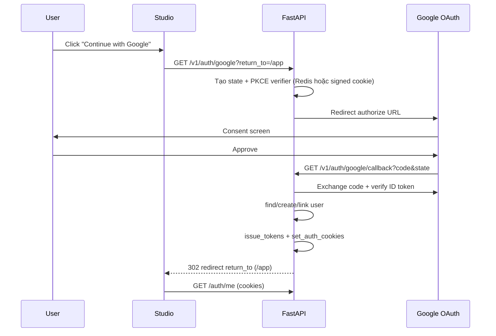

# Google OAuth Login — Master Plan

> **Tính năng:** Đăng nhập / đăng ký bằng Google cho DashZen Studio.
>
> **Trạng thái:** **Done** (2026-06-27)
>
> **Ngày lập:** 2026-06-26
>
> **Chi tiết triển khai:**
> - Backend → [`phases/Backend/auth/08-google-oauth.md`](./phases/Backend/auth/08-google-oauth.md)
> - Frontend → [`phases/UI/Auth/11-google-oauth.md`](./phases/UI/Auth/11-google-oauth.md)
> - Checklist → [`phases/Backend/auth/09-google-oauth-checklist.md`](./phases/Backend/auth/09-google-oauth-checklist.md)

---

## 1. Tóm tắt

DashZen hiện có auth email/password hoàn chỉnh: JWT access + refresh trong **httpOnly cookies**, email OTP verification, silent refresh, rate limiting. **Chưa có OAuth.**

Google login sẽ **tái sử dụng** `AuthService.issue_tokens()` + `set_auth_cookies()` sau khi xác thực Google thành công — không thay đổi luồng session hiện có (`/auth/me`, refresh, logout, task ownership).

### Mục tiêu sản phẩm

| Mục tiêu | Mô tả |
|----------|-------|
| Giảm friction đăng ký | Một click → vào app, không cần OTP |
| Tin cậy email | Google xác nhận email → `email_verified=true` ngay |
| An toàn | OAuth Authorization Code + PKCE, `state` chống CSRF |
| Tương thích prod | Hoạt động với Render API + Vercel proxy `/api` |
| Account linking | Email trùng với tài khoản password → quy tắc rõ ràng |

### Không nằm scope (v1 Google)

| Out of scope | Ghi chú |
|--------------|---------|
| GitHub OAuth | **Planned** — [`github-oauth-login.md`](./github-oauth-login.md) |
| Link/unlink Google trong Settings | Phase 2 |
| Google One Tap | UX nâng cao, đánh giá sau |
| better-auth migration | Giữ stack FastAPI tự build |

---

## 2. Kiến trúc đề xuất

### 2.1 Pattern: BFF OAuth (backend xử lý toàn bộ)

Studio **không** nhận access token Google. FastAPI làm OAuth client, đổi `code` → tokens, validate ID token, tạo/link user, set **DashZen cookies** như login thường.



**Lý do chọn BFF:**

- Khớp kiến trúc cookie hiện tại — token không lộ ra JS
- Proxy Vercel `/api` chỉ cần cho **bước khởi tạo**; callback nên trỏ thẳng API (Render) để `Set-Cookie` đúng domain backend hoặc qua proxy đã có `rewriteProxySetCookie`
- Tránh lưu Google tokens phía client

### 2.2 Redirect URI (production)

| Môi trường | `GOOGLE_REDIRECT_URI` |
|------------|------------------------|
| Local dev | `http://localhost:8000/v1/auth/google/callback` |
| Production (khuyến nghị) | `https://dashzen-api.onrender.com/v1/auth/google/callback` |
| Production (alternative) | `https://<studio-domain>/api/v1/auth/google/callback` — cần verify proxy forward query string + cookie rewrite |

**Khuyến nghị:** Callback trực tiếp Render API; nút Google trên Studio dùng `resolveApiUrl('/v1/auth/google')` (dev: `:8000`, prod: `/api` proxy).

### 2.3 Thư viện backend

| Lựa chọn | Ưu | Nhược |
|----------|-----|-------|
| **Authlib** (đề xuất) | OAuth2 client chuẩn, tích hợp httpx async | Thêm dependency |
| `google-auth` + httpx thủ công | Nhẹ | Nhiều boilerplate |

**Đề xuất:** `authlib` trong `apps/api` hoặc `packages/core`.

---

## 3. Quyết định thiết kế (đã chốt cho plan)

| # | Quyết định | Lựa chọn | Lý do |
|---|------------|----------|-------|
| D1 | Bảng OAuth | `oauth_accounts` riêng | Mở rộng multi-provider; `UNIQUE(provider, provider_subject)` |
| D2 | `password_hash` | **Nullable** | OAuth-only user không có password |
| D3 | Email verified | `true` ngay khi Google `email_verified=true` | Bỏ OTP cho Google signup |
| D4 | Account linking | Email đã tồn tại + có password | Yêu cầu login password trước khi link (Phase 1) hoặc auto-link nếu Google email verified (đơn giản hơn — xem §4) |
| D5 | `state` storage | Redis TTL 10 phút | Đã có `redis_url` trong stack; fallback signed cookie nếu Redis off |
| D6 | Scopes Google | `openid email profile` | Đủ email, tên, avatar |
| D7 | Avatar | Dùng `avatar_key` upload riêng; không sync Google picture v1 | Tránh hotlink + GDPR đơn giản |
| D8 | Delete account OAuth-only | Cho phép xóa bằng confirmation text, không cần password | Cập nhật `DELETE /auth/me` |

### 4. Account linking — ma trận

| Tình huống | Hành vi đề xuất (v1) |
|------------|----------------------|
| Email Google chưa có trong DB | Tạo user mới + `oauth_accounts` row |
| Email đã có, **chỉ password**, chưa có Google link | **409 `account_exists_password`** — redirect FE `/login?link=google&email=...` với hướng dẫn đăng nhập password rồi link sau (Phase 2) **hoặc** auto-link nếu policy team chấp nhận rủi ro |
| Email đã có, đã link Google | Login bình thường |
| Google `email_verified=false` | **400 `google_email_unverified`** — từ chối |

**Khuyến nghị MVP:** Auto-link khi email Google đã verified **và** trùng email user hiện có (Google đã chứng minh ownership). Ghi audit log. Nếu product muốn chặt hơn → Phase 1.5 thêm password confirmation.

---

## 5. Thay đổi schema (tóm tắt)

Migration `00X_google_oauth.py`:

```sql
-- users: cho phép OAuth-only
ALTER TABLE users ALTER COLUMN password_hash DROP NOT NULL;

-- bảng mới
CREATE TABLE oauth_accounts (
    id UUID PRIMARY KEY DEFAULT gen_random_uuid(),
    user_id UUID NOT NULL REFERENCES users(id) ON DELETE CASCADE,
    provider VARCHAR(32) NOT NULL,
    provider_subject VARCHAR(255) NOT NULL,
    email_at_link VARCHAR(255),
    created_at TIMESTAMPTZ NOT NULL DEFAULT now(),
    UNIQUE (provider, provider_subject)
);
CREATE INDEX ix_oauth_accounts_user_id ON oauth_accounts(user_id);
```

Chi tiết model + repository → [08-google-oauth.md](./phases/Backend/auth/08-google-oauth.md) §4.

---

## 6. API mới (tóm tắt)

| Method | Path | Mô tả |
|--------|------|-------|
| `GET` | `/v1/auth/google` | Redirect tới Google; query `return_to` (optional, whitelist `/app/*`) |
| `GET` | `/v1/auth/google/callback` | Xử lý callback; set cookies; redirect Studio |

Errors (callback redirect hoặc JSON):

| Code | HTTP | Ý nghĩa |
|------|------|---------|
| `oauth_state_invalid` | 400 | CSRF / state hết hạn |
| `oauth_exchange_failed` | 502 | Google token endpoint lỗi |
| `google_email_unverified` | 400 | Google chưa verify email |
| `account_exists_password` | 409 | Cần link thủ công (nếu bật policy chặt) |
| `oauth_provider_disabled` | 503 | Thiếu env Google |

Rate limit: `10/minute` initiate, `20/minute` callback (theo IP).

---

## 7. Env vars mới

```bash
# Google OAuth
GOOGLE_OAUTH_ENABLED=true
GOOGLE_CLIENT_ID=
GOOGLE_CLIENT_SECRET=
GOOGLE_REDIRECT_URI=http://localhost:8000/v1/auth/google/callback

# Optional: hosted domain restriction (Workspace)
# GOOGLE_HD=

# OAuth state (nếu dùng Redis — đã có REDIS_URL)
OAUTH_STATE_TTL_SECONDS=600
```

Cập nhật `.env.example`, Render dashboard, Vercel (chỉ `GOOGLE_OAUTH_ENABLED` + public client ID nếu cần One Tap sau).

**Google Cloud Console:**

1. APIs & Services → Credentials → OAuth 2.0 Client ID (Web application)
2. Authorized redirect URIs: local + production callback
3. Authorized JavaScript origins: `http://localhost:3000`, `https://<studio-domain>`
4. OAuth consent screen: External, scopes `email`, `profile`, `openid`

---

## 8. Frontend (tóm tắt)

| Thay đổi | File / vị trí |
|----------|----------------|
| Nút "Continue with Google" | `LoginForm.tsx`, `RegisterForm.tsx` |
| Helper redirect | `lib/api/auth.ts` → `startGoogleLogin(returnTo?)` |
| Error query params | `/login?error=oauth_state_invalid` → toast |
| Settings | Ẩn "Change password" nếu `user.has_password === false` (field mới API) |

Chi tiết UI/UX → [11-google-oauth.md](./phases/UI/Auth/11-google-oauth.md).

---

## 9. Ảnh hưởng tính năng hiện có

| Tính năng | Thay đổi cần |
|-----------|--------------|
| Login password | Không đổi |
| Register + OTP | Vẫn giữ; Google là đường song song |
| `email_not_verified` | Không áp dụng user Google |
| Change password | Chỉ hiện khi `password_hash IS NOT NULL` |
| Delete account | OAuth-only: bỏ yêu cầu password, giữ `confirmation: "DELETE"` |
| `GET /auth/me` | Thêm `auth_providers: ["password"]` hoặc `["google"]` |
| Tests | Mock Google token exchange; integration với test client |

---

## 10. Thứ tự triển khai

```
Phase A — Backend foundation (2–3 ngày)
  ├── Migration oauth_accounts + nullable password_hash
  ├── Config GOOGLE_* + feature flag
  ├── GoogleOAuthService (state, exchange, verify id_token)
  ├── Routes GET google + callback
  └── Tests unit + API (mock Google)

Phase B — Frontend (1–2 ngày)
  ├── Google button + startGoogleLogin()
  ├── Error handling query params
  └── Settings: conditional change-password

Phase C — Hardening (1 ngày)
  ├── Rate limits, logging (không log tokens)
  ├── E2E Playwright smoke (optional)
  ├── Google Console prod credentials
  └── Cập nhật 07/09 implementation-status

Phase D — Phase 2 (sau v1)
  ├── Link/unlink Google in Settings
  ├── Password set flow cho OAuth-only user
  └── GitHub provider
```

---

## 11. Rủi ro & giảm thiểu

| Rủi ro | Giảm thiểu |
|--------|-------------|
| Cookie không set qua proxy | Test prod với callback URI thật; dùng `rewriteProxySetCookie` |
| Account takeover qua email trùng | Chỉ auto-link khi `email_verified` từ Google; log `oauth_link` |
| Redis down → state fail | Fallback signed state cookie httponly |
| Google outage | 502 rõ ràng; không fallback password |
| Secret leak | Chỉ `GOOGLE_CLIENT_SECRET` trên Render, không Vercel |

---

## 12. Definition of Done (v1)

- [ ] User click Google trên `/login` → consent → vào `/app` với session hợp lệ
- [ ] User Google mới không cần `/verify-email`
- [ ] `GET /auth/me` phản ánh `email_verified=true`
- [ ] Logout / refresh hoạt động như password login
- [ ] OAuth disabled khi `GOOGLE_OAUTH_ENABLED=false` → 503 hoặc ẩn nút FE
- [ ] ≥ 15 tests mới (service mock + API + linking edge cases)
- [ ] `.env.example` + plan status cập nhật

---

## Cross-references

| Tài liệu | Liên quan |
|----------|-----------|
| [Backend auth README](./phases/Backend/auth/README.md) | Auth stack hiện tại |
| [01-jwt-flow.md](./phases/Backend/auth/01-jwt-flow.md) | Cookie/JWT reuse |
| [06-email-verification.md](./phases/Backend/auth/06-email-verification.md) | OTP bypass cho Google |
| [UI Auth README](./phases/UI/Auth/README.md) | Forms, guards |
| [proxy.ts](../apps/studio/lib/api/proxy.ts) | Cookie path rewrite prod |
| [config.py](../packages/core/src/core/config.py) | Settings pattern |
