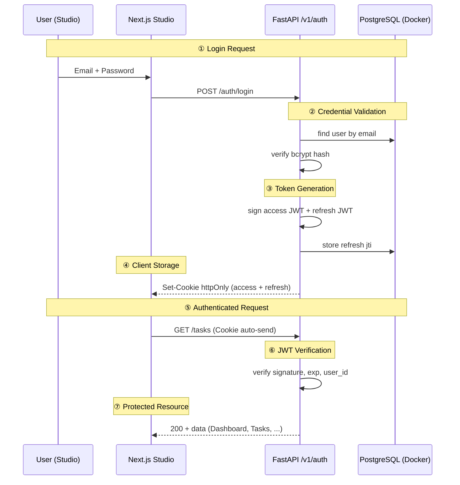
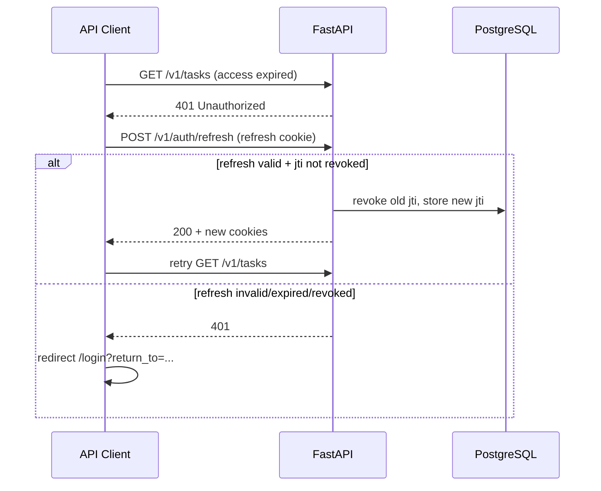

# 01 — JWT Flow (chuẩn ↔ DashZen)

> Map **7 bước JWT Authentication Flow** (industry standard) sang implementation DashZen.
>
> DashZen **không** dùng localStorage/sessionStorage cho token — chọn **httpOnly cookie** (bảo mật hơn, align plan 02 §2.1).

---

## 1. Flow tổng quan



---

## 2. Bảng map 7 bước → DashZen

| # | Bước chuẩn (hình) | DashZen MVP | Ghi chú |
|---|-------------------|-------------|---------|
| 1 | **User Login** — form email/password | `app/(auth)/login/page.tsx` + `POST /v1/auth/login` | react-hook-form + zod |
| 2 | **Credential Validation** | `AuthService.login()` — bcrypt verify | FastAPI |
| 3 | **JWT Generation** | `create_access_token()` + `create_refresh_token()` | HS256/RS256, `sub`=user_id |
| 4 | **Client Storage** | **httpOnly Secure cookies** — không localStorage | `SameSite=Lax`, path `/` |
| 5 | **Authenticated Request** | `fetch(url, { credentials: 'include' })` | Cookie auto; Bearer optional |
| 6 | **JWT Verification** | `get_current_user` dependency mỗi protected route | signature + exp + user exists |
| 7 | **Protected Resource** | `/app/*`, `/v1/tasks/*`, `/v1/tasks/{id}/stream` | 401 nếu fail |

---

## 3. JWT structure

### 3.1 Access token (short-lived)

```json
{
  "sub": "uuid-user-id",
  "email": "user@example.com",
  "type": "access",
  "iat": 1719000000,
  "exp": 1719000900
}
```

| Field | Giá trị (as-built) |
|-------|---------------------|
| Algorithm | HS256 (default) hoặc RS256 |
| Secret / Keys | `JWT_SECRET_KEY` hoặc PEM pair |
| TTL | **15 phút** (`JWT_ACCESS_TOKEN_EXPIRE_MINUTES`) |
| Storage | Cookie `dashzen_access_token` |

### 3.2 Refresh token (long-lived)

```json
{
  "sub": "uuid-user-id",
  "type": "refresh",
  "jti": "unique-token-id",
  "iat": 1719000000,
  "exp": 1719604800
}
```

| Field | Giá trị (as-built) |
|-------|---------------------|
| TTL | 7 ngày |
| Storage | Cookie `dashzen_refresh_token` |
| Rotation | Mỗi refresh → revoke `jti` cũ + issue mới + lưu DB |
| Revocation | Logout revoke `jti`; stolen token không dùng lại được |

---

## 4. Cookie policy

| Cookie | httpOnly | Secure (prod) | SameSite | Path |
|--------|----------|---------------|----------|------|
| `dashzen_access_token` | ✓ | ✓ | Lax | `/` |
| `dashzen_refresh_token` | ✓ | ✓ | Lax | `/v1/auth` |

> Refresh cookie path `/v1/auth` — chỉ gửi khi gọi refresh/logout, giảm surface.

**Dev (localhost):** `Secure=false` khi `APP_ENV=development` (hoặc override `COOKIE_SECURE`).

---

## 5. Silent refresh flow



**Rules:**

- Refresh **silent** — không logout đột ngột
- Chỉ **1 retry** sau refresh thành công
- Refresh fail → redirect `/login?return_to={currentPath}`
- **SSE stream 401** → stop stream → toast → redirect (không retry stream tự động)

---

## 6. Route guard (dual layer)

| Layer | Vị trí | Vai trò |
|-------|--------|---------|
| **Next.js middleware** | `apps/studio/middleware.ts` | Redirect sớm — `/app/*` chưa login → `/login` |
| **AuthGuard** | `components/auth/AuthGuard.tsx` | Client guard trong `(app)` layout — double-check session |
| **FastAPI deps** | `get_current_user` | **Source of truth** — mọi API protected |

> Middleware FE chỉ check cookie **tồn tại** (optimistic). API vẫn verify JWT đầy đủ.

---

## 7. Guest-only routes

| Route | Hành vi nếu đã login |
|-------|----------------------|
| `/login` | Redirect → `/app` |
| `/register` | Redirect → `/app` |

---

## 8. DashZen vs hình (deviations có chủ đích)

| Hình (generic) | DashZen | Lý do |
|----------------|---------|-------|
| localStorage / sessionStorage | **httpOnly cookie** | XSS không đọc được token |
| `Authorization: Bearer` only | Cookie **primary**, Bearer fallback | Studio same-origin; API tools dùng Bearer |
| Node/Express | **FastAPI** | Plan 01 stack |
| Single JWT | **Access + Refresh** | Silent refresh, shorter access TTL |
| Stateless refresh | **DB-backed jti revocation** | Logout + rotation an toàn |
| — | `user_id` on Task | Multi-tenant ready |

---

## 9. Phase 2+ (không MVP hiện tại)

- ~~Refresh token rotation + denylist~~ **Done** (Postgres `refresh_tokens`)
- better-auth migration (plan 02 §20 gap)
- OAuth providers
- **Email verification (OTP 6 số)** → [06-email-verification.md](./06-email-verification.md)
- Password reset email
- Redis access token blacklist (optional — TTL 15 phút đã giảm rủi ro)
