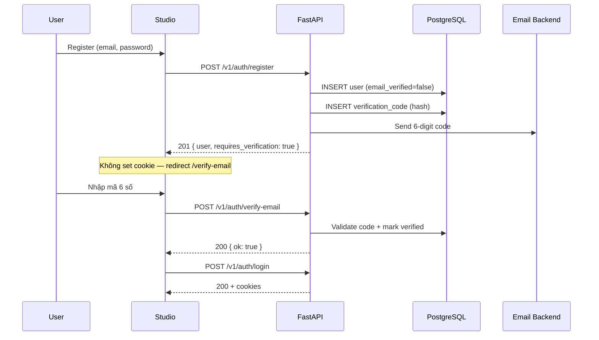

# 06 — Email Verification (Đề xuất triển khai)

> **Trạng thái:** **Đã implement** (2026-06-22) — 35 tests pass.
>
> **Yêu cầu:** Sau đăng ký, gửi email chứa mã 6 số; người dùng nhập mã để xác thực email trước khi dùng tài khoản đầy đủ.

---

## 1. Tóm tắt đề xuất

| Quyết định | Đề xuất |
|------------|---------|
| Luồng | **Đăng ký → tạo user (`email_verified=false`) → gửi OTP → xác thực → đăng nhập** |
| Mã OTP | 6 chữ số, `secrets.randbelow`, TTL **15 phút** |
| Lưu mã | Hash bcrypt/SHA256 trong DB — **không lưu plain text** |
| Gửi mail | Abstraction `EmailBackend` — SMTP production, Console/Mailpit dev |
| Login khi chưa verify | **403 `email_not_verified`** — không cấp JWT |
| Resend | Endpoint riêng, rate limit chặt (3 lần/giờ/email) |

---

## 2. Hiện trạng codebase

| Thành phần | Trạng thái |
|------------|------------|
| SMTP / email service | **Chưa có** |
| Mail server trong Docker | **Chưa có** (cần thêm Mailpit) |
| `User.email_verified` | **Chưa có** |
| Bảng lưu OTP | **Chưa có** |
| Auth register hiện tại | Tạo user + **auto-login** (set cookies ngay) — **cần đổi** |

**Ảnh hưởng breaking:** Register sẽ không còn set cookies ngay; FE cần màn hình nhập mã sau register.

---

## 3. Luồng nghiệp vụ đề xuất



### 3.1 Tại sao không auto-login sau register?

- User chưa verify email → không nên cấp JWT (tránh dùng app với email giả/spam).
- Tách rõ 2 bước: **identity created** vs **identity verified**.

### 3.2 Phương án thay thế (không khuyến nghị MVP)

| Phương án | Mô tả | Nhược điểm |
|-----------|-------|------------|
| Verify trước khi tạo user | Lưu pending registration trong Redis | Phức tạp hơn, mất data nếu Redis flush |
| Magic link thay OTP | Gửi URL click | Cần FE route + token dài hơn |
| Verify optional | Cho login nhưng giới hạn tính năng | Khó enforce, UX mơ hồ |

---

## 4. Data model

### 4.1 Bổ sung `users`

```python
email_verified: bool = False          # default False
email_verified_at: datetime | None    # set khi verify thành công
```

### 4.2 Bảng mới `email_verification_codes`

```python
class EmailVerificationCode(Base):
    __tablename__ = "email_verification_codes"

    id: UUID                    # PK
    user_id: UUID               # FK → users.id, CASCADE
    code_hash: str              # bcrypt hash của 6-digit code
    expires_at: datetime        # timezone-aware
    attempts: int = 0           # số lần nhập sai
    max_attempts: int = 5
    consumed_at: datetime | None  # set khi verify OK
    created_at: datetime
```

**Quy tắc:**
- Mỗi lần resend → revoke code cũ (hoặc mark consumed) + tạo code mới.
- Chỉ 1 code **active** per user tại một thời điểm.
- Cron/background job xóa codes hết hạn (optional Phase 2).

---

## 5. OTP — sinh mã & bảo mật

```python
# packages/core/src/core/auth/otp.py

def generate_verification_code() -> str:
    """6-digit zero-padded, cryptographically secure."""
    return f"{secrets.randbelow(1_000_000):06d}"

def hash_verification_code(code: str) -> str: ...
def verify_verification_code(plain: str, hashed: str) -> bool: ...  # constant-time
```

| Thuộc tính | Giá trị |
|------------|---------|
| Độ dài | 6 chữ số (000000–999999) |
| Entropy | ~20 bit — đủ với TTL ngắn + rate limit |
| TTL | 15 phút (config `EMAIL_VERIFICATION_CODE_TTL_MINUTES`) |
| Max attempts | 5 lần sai → code vô hiệu, phải resend |
| Storage | Hash only — giống password |

---

## 6. Email — abstraction & template

### 6.1 Cấu trúc package đề xuất

```
packages/core/src/core/
├── email/
│   ├── __init__.py
│   ├── backend.py          # Protocol EmailBackend
│   ├── smtp.py             # SMTPEmailBackend (aiosmtplib)
│   ├── console.py          # ConsoleEmailBackend (dev — log ra stdout)
│   └── templates/
│       └── verification.py # render subject + html + text
```

### 6.2 Interface

```python
class EmailBackend(Protocol):
    async def send_verification_code(
        self,
        to: str,
        code: str,
        expires_minutes: int,
    ) -> None: ...
```

### 6.3 Template chuẩn

**Subject:** `Your DashZen verification code`

**Plain text:**
```
Hi,

Your verification code is: 123456

This code expires in 15 minutes.

If you didn't create a DashZen account, you can ignore this email.

— DashZen Team
```

**HTML:** Layout tối giản — logo, mã in đậm monospace, thời gian hết hạn, footer.

### 6.4 Dev & Production

| Môi trường | Backend | Ghi chú |
|------------|---------|---------|
| development | `ConsoleEmailBackend` hoặc Mailpit SMTP | Mailpit UI: `http://localhost:8025` |
| staging/production | SMTP (SendGrid, SES, Resend SMTP) | Credentials qua env |

**Docker Compose bổ sung (dev):**
```yaml
mailpit:
  image: axllent/mailpit
  ports:
    - "1025:1025"   # SMTP
    - "8025:8025"   # Web UI
```

---

## 7. API contracts (mới / thay đổi)

### 7.1 POST `/v1/auth/register` — **thay đổi**

**Response `201` (không còn Set-Cookie):**
```json
{
  "user": {
    "id": "...",
    "email": "user@example.com",
    "display_name": "Kim",
    "email_verified": false
  },
  "requires_verification": true
}
```

Sau register: gửi email async (hoặc sync MVP).

### 7.2 POST `/v1/auth/verify-email` — **mới**

**Request:**
```json
{
  "email": "user@example.com",
  "code": "123456"
}
```

**Response `200`:**
```json
{ "ok": true }
```

**Errors:**

| Status | code | Khi nào |
|--------|------|---------|
| 400 | `validation_error` | Code không đúng format |
| 400 | `invalid_code` | Code sai hoặc hết hạn |
| 400 | `too_many_attempts` | Vượt max attempts |
| 404 | `user_not_found` | Email không tồn tại |
| 409 | `already_verified` | Đã verify rồi |

### 7.3 POST `/v1/auth/resend-verification` — **mới**

**Request:**
```json
{ "email": "user@example.com" }
```

**Response `200`:**
```json
{ "ok": true }
```

Luôn trả 200 (kể cả email không tồn tại) — **chống email enumeration**.

Rate limit: **3/giờ/email**, **5/phút/IP**.

### 7.4 POST `/v1/auth/login` — **thay đổi**

Thêm check:
```python
if not user.email_verified:
    raise EmailNotVerifiedError()  # 403
```

---

## 8. Config (env mới)

```env
# ── Email ────────────────────────────────────────────
EMAIL_BACKEND=console              # console | smtp
EMAIL_FROM=noreply@dashzen.local
EMAIL_VERIFICATION_CODE_TTL_MINUTES=15
EMAIL_VERIFICATION_MAX_ATTEMPTS=5

# SMTP (when EMAIL_BACKEND=smtp)
SMTP_HOST=localhost
SMTP_PORT=1025
SMTP_USER=
SMTP_PASSWORD=
SMTP_TLS=false
```

---

## 9. Tổ chức code đề xuất

```
packages/core/src/core/
├── auth/
│   └── otp.py
├── email/
│   ├── backend.py
│   ├── smtp.py
│   ├── console.py
│   └── templates/verification.py
├── exceptions.py          # + EmailNotVerifiedError, InvalidVerificationCodeError
└── schemas/auth.py          # + VerifyEmailRequest, ResendVerificationRequest

packages/db/src/db/
├── models/email_verification.py
├── repositories/email_verification.py
└── services/
    ├── auth.py              # register: không issue_tokens; login: check verified
    └── email_verification.py  # send, verify, resend logic

apps/api/src/api/routes/
└── auth.py                  # + verify-email, resend-verification endpoints
```

---

## 10. Bảo mật & rate limiting

| Vector | Biện pháp |
|--------|-----------|
| Brute force OTP | Max 5 attempts/code; rate limit verify endpoint |
| Email spam (resend) | 3 resend/giờ/email; không leak user exists |
| Timing attack | `hmac.compare_digest` hoặc bcrypt verify |
| OTP trong log | Không log plain code (chỉ log "sent to user@...") |
| Register spam | Giữ rate limit register hiện có (10/min) |

---

## 11. Frontend (Studio) — thay đổi cần thiết

| Màn hình | Hành vi |
|----------|---------|
| `/register` | Sau 201 → redirect `/verify-email?email=...` |
| `/verify-email` | Form 6 ô số / 1 input; nút Resend (cooldown 60s) |
| `/login` | Nếu 403 `email_not_verified` → redirect verify |

Xem chi tiết bổ sung tại [03-frontend.md](./03-frontend.md) (cần update khi implement).

---

## 12. Testing

| Test | Loại |
|------|------|
| `generate_verification_code` format 6 digits | unit |
| Hash/verify roundtrip | unit |
| Register → không có cookies | integration |
| Verify đúng code → `email_verified=true` | integration |
| Verify sai code → attempts++ | integration |
| Login chưa verify → 403 | integration |
| Resend tạo code mới, revoke cũ | integration |
| Email backend console captures message | unit |

---

## 13. Migration

**`003_email_verification.py`:**
- `users.email_verified` (bool, default false)
- `users.email_verified_at` (nullable datetime)
- `email_verification_codes` table
- Existing users: `email_verified=true` (backfill) để không lock out

---

## 14. Thứ tự implement đề xuất

1. **Infra:** Mailpit trong docker-compose (dev)
2. **Core:** `otp.py` + `email/` package + exceptions
3. **DB:** migration 003 + repository
4. **Service:** `EmailVerificationService` + sửa `AuthService.register/login`
5. **API:** 2 endpoints mới + sửa register response
6. **Tests:** unit + integration (27+ tests hiện có cần update)
7. **FE:** `/verify-email` page + sửa register flow
8. **Plan:** update 04-api-contracts, 05-checklist

**Ước lượng:** ~2–3 ngày backend + ~1 ngày frontend.

---

## 15. Rủi ro & lưu ý

| Rủi ro | Giảm thiểu |
|--------|------------|
| Breaking change register flow | FE + BE deploy đồng bộ; document trong changelog |
| SMTP deliverability | Dùng provider chuyên nghiệp (SES/SendGrid) ở prod |
| Email vào spam | SPF/DKIM/DMARC ở domain production |
| User quên verify | Resend + reminder email (Phase 2) |

---

## 16. Phụ thuộc

```
Email Verification
    │
    ├── Auth hardening (đã xong) — refresh revocation, rate limit
    ├── Mailpit (dev) hoặc SMTP credentials (prod)
    ├── Migration 003
    └── FE verify-email page
```
