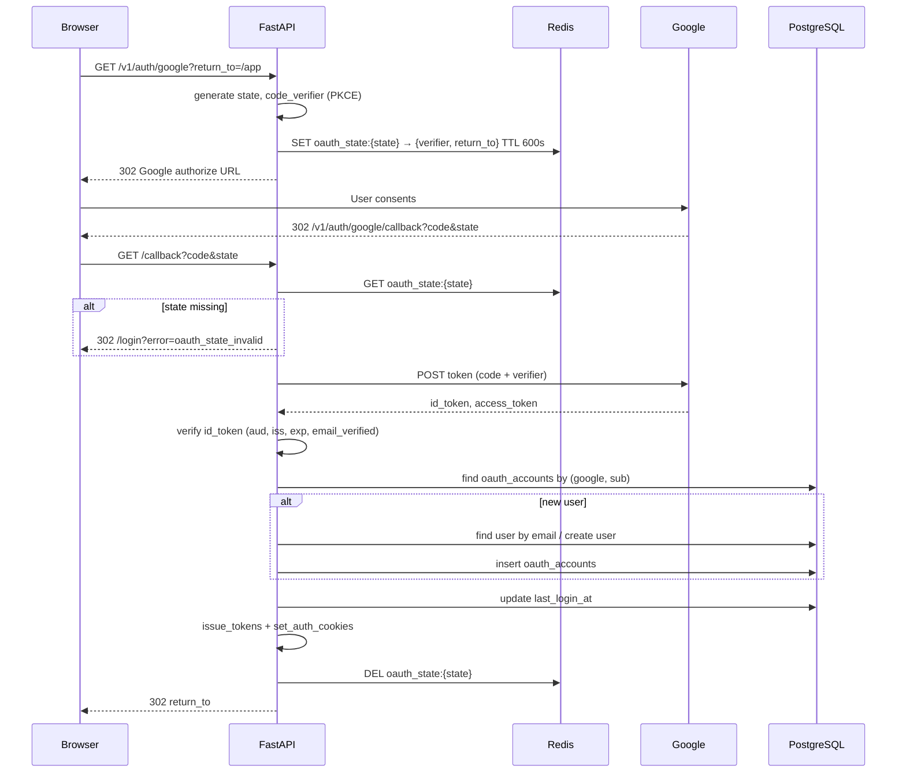

# 08 — Google OAuth (Backend)

> **Trạng thái:** Planned
>
> **Master plan:** [`../../../google-oauth-login.md`](../../../google-oauth-login.md)
>
> **Phụ thuộc:** Auth MVP done ([07-implementation-status.md](./07-implementation-status.md)), Redis optional, Render + Vercel proxy

---

## 1. Hiện trạng (as-built)

| Thành phần | Path | Ghi chú |
|------------|------|---------|
| Auth routes | `apps/api/src/api/routes/auth.py` | register, login, refresh, me — **không OAuth** |
| Auth service | `packages/db/src/db/services/auth.py` | `issue_tokens()` tái sử dụng được |
| JWT / cookies | `packages/core/src/core/auth/jwt.py`, `cookies.py` | httpOnly, SameSite |
| User model | `packages/db/src/db/models/user.py` | `password_hash NOT NULL` — **blocker** |
| Email verify | `packages/db/src/db/services/email_verification.py` | Bỏ qua cho Google verified email |
| Config | `packages/core/src/core/config.py` | Chưa có `GOOGLE_*` |
| Deps | `apps/api/src/api/deps.py` | `get_current_user` — không đổi |

**Grep OAuth:** Không có `authlib`, `google.oauth`, callback routes.

---

## 2. Luồng kỹ thuật



---

## 3. Package layout đề xuất

```
packages/core/src/core/
  auth/
    google_oauth.py          # verify_id_token, parse claims
  config.py                  # + GOOGLE_* settings

packages/db/src/db/
  models/
    oauth_account.py         # OAuthAccount model
  repositories/
    oauth_account.py         # CRUD + lookup
  services/
    google_oauth_service.py  # orchestration: callback → User

apps/api/src/api/
  routes/
    auth_google.py           # router prefix /v1/auth/google
  # hoặc mở rộng auth.py
```

**Router mount** trong `apps/api/src/api/main.py`:

```python
from api.routes.auth_google import router as auth_google_router
app.include_router(auth_google_router)
```

---

## 4. Data model

### 4.1 Migration `00X_google_oauth.py`

```python
def upgrade():
    op.alter_column("users", "password_hash", nullable=True)

    op.create_table(
        "oauth_accounts",
        sa.Column("id", UUID, primary_key=True),
        sa.Column("user_id", UUID, sa.ForeignKey("users.id", ondelete="CASCADE"), nullable=False),
        sa.Column("provider", sa.String(32), nullable=False),
        sa.Column("provider_subject", sa.String(255), nullable=False),
        sa.Column("email_at_link", sa.String(255), nullable=True),
        sa.Column("created_at", sa.DateTime(timezone=True), server_default=sa.func.now()),
        sa.UniqueConstraint("provider", "provider_subject", name="uq_oauth_provider_subject"),
    )
    op.create_index("ix_oauth_accounts_user_id", "oauth_accounts", ["user_id"])
```

### 4.2 SQLAlchemy model

```python
class OAuthAccount(Base):
    __tablename__ = "oauth_accounts"
    __table_args__ = (UniqueConstraint("provider", "provider_subject"),)

    id: Mapped[uuid.UUID]
    user_id: Mapped[uuid.UUID]  # FK users
    provider: Mapped[str]       # "google"
    provider_subject: Mapped[str]  # Google `sub`
    email_at_link: Mapped[str | None]
    created_at: Mapped[datetime]
```

### 4.3 User model change

```python
password_hash: Mapped[str | None] = mapped_column(String(255), nullable=True)
```

**Helper property (service layer):**

```python
def has_password(user: User) -> bool:
    return user.password_hash is not None
```

---

## 5. Config (`packages/core/src/core/config.py`)

```python
google_oauth_enabled: bool = False
google_client_id: str = ""
google_client_secret: str = ""
google_redirect_uri: str = "http://localhost:8000/v1/auth/google/callback"
google_hd: str | None = None  # optional Workspace domain lock
oauth_state_ttl_seconds: int = 600
```

Validation startup: nếu `google_oauth_enabled` và thiếu client id/secret → log warning hoặc fail fast prod.

---

## 6. `GoogleOAuthService`

File: `packages/db/src/db/services/google_oauth_service.py`

### 6.1 Public methods

| Method | Mô tả |
|--------|-------|
| `build_authorize_url(state, code_challenge, return_to)` | URL Google với PKCE S256 |
| `save_oauth_state(state, verifier, return_to)` | Redis hoặc signed cookie |
| `pop_oauth_state(state)` | One-time read + delete |
| `exchange_code(code, verifier)` | Authlib → tokens |
| `authenticate(claims) -> User` | find/create/link + `email_verified=True` |

### 6.2 ID token validation

| Claim | Kiểm tra |
|-------|----------|
| `iss` | `accounts.google.com` hoặc `https://accounts.google.com` |
| `aud` | `GOOGLE_CLIENT_ID` |
| `exp` | not expired |
| `email` | required, lowercase |
| `email_verified` | must be `true` |
| `sub` | required — lưu `provider_subject` |

Dùng `authlib.integrations.httpx_client` hoặc `google.oauth2.id_token.verify_oauth2_token`.

### 6.3 User resolution (`authenticate`)

```python
async def authenticate(self, claims: GoogleClaims) -> User:
    oauth = await get_oauth_account(self.session, "google", claims.sub)
    if oauth:
        user = await get_user_by_id(self.session, oauth.user_id)
        ...
        return user

    email = claims.email.lower()
    user = await get_user_by_email(self.session, email)

    if user is None:
        user = await create_user(
            self.session,
            email=email,
            password_hash=None,
            display_name=claims.name,
        )
        await mark_email_verified(self.session, user.id)
        await create_oauth_account(...)
        await self.session.commit()
        return user

    # Existing email — auto-link if Google verified (v1 policy)
    if user.password_hash is not None and not await has_oauth_account(...):
        await create_oauth_account(self.session, user.id, "google", claims.sub, email)
        await mark_email_verified(self.session, user.id)
        await self.session.commit()
        return user

    ...
```

---

## 7. Routes

File: `apps/api/src/api/routes/auth_google.py`

```python
router = APIRouter(prefix="/v1/auth", tags=["auth"])

@router.get("/google")
@rate_limit("10/minute")
async def google_login_start(
    request: Request,
    return_to: str = "/app",
    session: AsyncSession = Depends(get_db),
):
    if not settings.google_oauth_enabled:
        raise OAuthProviderDisabledError()
    return_to = sanitize_return_to(return_to)  # whitelist /app/*
    state, verifier, challenge = generate_pkce()
    await oauth_state_store.save(state, verifier, return_to)
    url = build_google_authorize_url(state, challenge)
    return RedirectResponse(url, status_code=302)

@router.get("/google/callback")
@rate_limit("20/minute")
async def google_login_callback(
    request: Request,
    code: str | None = None,
    state: str | None = None,
    error: str | None = None,
    session: AsyncSession = Depends(get_db),
):
    ...
    auth_service = AuthService(session)
    user = await google_oauth_service.authenticate(claims)
    tokens = await auth_service.issue_tokens(user)
    response = RedirectResponse(return_to, status_code=302)
    set_auth_cookies(response, tokens.access_token, tokens.refresh_token)
    return response
```

### 7.1 `sanitize_return_to`

Chỉ cho phép path bắt đầu `/app`, reject `//`, external URL.

### 7.2 Error redirect

Thay vì JSON trên callback, redirect:

```
/login?error=oauth_state_invalid
/login?error=google_email_unverified
```

FE map error → toast (xem UI plan).

---

## 8. Exceptions mới (`packages/core/src/core/exceptions.py`)

```python
class OAuthProviderDisabledError(AuthError):
    code = "oauth_provider_disabled"

class OAuthStateInvalidError(AuthError):
    code = "oauth_state_invalid"

class OAuthExchangeFailedError(AuthError):
    code = "oauth_exchange_failed"

class GoogleEmailUnverifiedError(AuthError):
    code = "google_email_unverified"

class AccountExistsPasswordError(AuthError):
    code = "account_exists_password"  # nếu dùng policy chặt
```

Handler trong `apps/api/src/api/errors.py` — callback dùng redirect, API JSON cho disabled trên `/google` start.

---

## 9. OAuth state storage

### 9.1 Redis (preferred)

```python
# key: oauth_state:{uuid}
# value: json {"verifier": "...", "return_to": "/app"}
# TTL: oauth_state_ttl_seconds
```

Dùng `redis_url` đã có trong config.

### 9.2 Fallback: signed cookie

Nếu `redis_url` empty:

- Set httponly cookie `dashzen_oauth_state` = signed payload (itsdangerous / JWT ngắn)
- SameSite=Lax, path `/v1/auth/google`

---

## 10. Thay đổi endpoint hiện có

### 10.1 `UserResponse` schema

```python
class UserResponse(BaseModel):
    ...
    has_password: bool
    auth_providers: list[str]  # ["password"] | ["google"] | ["password", "google"]
```

Compute từ `password_hash` + `oauth_accounts`.

### 10.2 `POST /auth/change-password`

- Nếu `not has_password` → **400 `no_password_auth`**
- OAuth user muốn set password → endpoint mới Phase 2: `POST /auth/set-password`

### 10.3 `DELETE /auth/me`

```python
# Hiện tại: require password
# Mới:
if user.password_hash is not None:
    verify_password(body.password, user.password_hash)
else:
    # OAuth-only: chỉ cần confirmation == "DELETE"
    pass
```

### 10.4 `AuthService.login`

Không đổi — user OAuth-only không có password, phải dùng Google.

### 10.5 `AuthService.register`

Không đổi — vẫn yêu cầu password + OTP.

---

## 11. Dependencies (`pyproject.toml`)

```toml
# apps/api/pyproject.toml hoặc packages/core
authlib = ">=1.3.0"
```

---

## 12. Security checklist

- [ ] PKCE S256 bắt buộc
- [ ] `state` one-time use
- [ ] Không log `code`, `id_token`, `client_secret`
- [ ] Rate limit initiate + callback
- [ ] Redirect URI khớp chính xác Google Console
- [ ] `return_to` whitelist — chống open redirect
- [ ] ID token verify `aud` + `iss`
- [ ] Feature flag tắt OAuth khi chưa config

---

## 13. Tests

| File | Cases |
|------|-------|
| `packages/db/tests/test_google_oauth_service.py` | create user, link existing, reject unverified email |
| `apps/api/tests/test_auth_google_api.py` | start redirect URL, callback mock, state invalid, cookies set |
| `apps/api/tests/test_auth_integration.py` | Google user refresh/me/logout |

**Mock pattern:**

```python
@pytest.fixture
def mock_google_token_exchange(monkeypatch):
    async def fake_exchange(code, verifier):
        return {"id_token": make_signed_test_jwt(sub="...", email="...", email_verified=True)}
    monkeypatch.setattr(google_oauth_service, "exchange_code", fake_exchange)
```

---

## 14. File tracker

| File | Action |
|------|--------|
| `packages/db/alembic/versions/00X_google_oauth.py` | Create |
| `packages/db/src/db/models/oauth_account.py` | Create |
| `packages/db/src/db/repositories/oauth_account.py` | Create |
| `packages/db/src/db/services/google_oauth_service.py` | Create |
| `packages/core/src/core/auth/google_oauth.py` | Create |
| `packages/core/src/core/config.py` | Modify |
| `packages/core/src/core/exceptions.py` | Modify |
| `packages/db/src/db/models/user.py` | Modify |
| `packages/db/src/db/repositories/user.py` | Modify (`create_user` nullable hash) |
| `packages/db/src/db/services/auth.py` | Modify delete_account |
| `apps/api/src/api/routes/auth_google.py` | Create |
| `apps/api/src/api/main.py` | Modify |
| `apps/api/src/api/errors.py` | Modify |
| `packages/core/src/core/schemas/auth.py` | Modify UserResponse |
| `.env.example` | Modify |
| `apps/api/tests/test_auth_google_api.py` | Create |

---

## 15. Observability

Structured logs (không PII nhạy cảm):

```python
log.info("google_oauth_start", return_to=return_to)
log.info("google_oauth_success", user_id=str(user.id), linked=linked)
log.warning("google_oauth_fail", reason="state_invalid")
```

Metric counter (nếu dùng monitoring hiện có):

- `auth_google_start_total`
- `auth_google_success_total`
- `auth_google_error_total{reason}`
