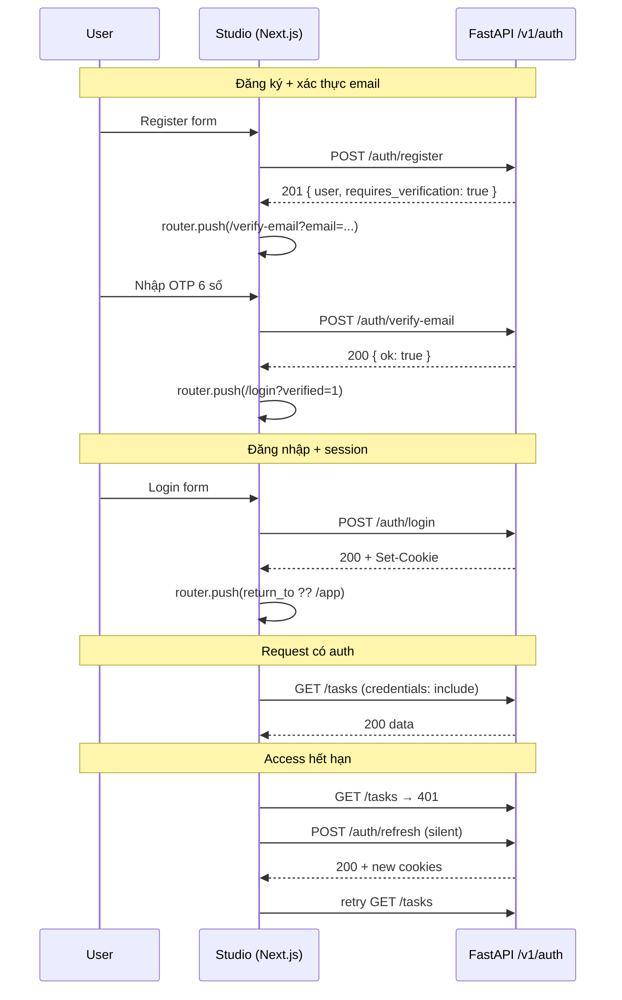

# 01 — Auth Flow (User Journeys ↔ Studio)

> Map **luồng xác thực end-to-end** từ góc nhìn người dùng và Studio UI.
>
> Backend JWT chi tiết: [Backend 01-jwt-flow.md](../../Backend/auth/01-jwt-flow.md)

---

## 1. Flow tổng quan (MVP)



---

## 2. Bảng map journey → UI + API

| # | Journey | Route UI | API | Cookie |
|---|---------|----------|-----|--------|
| 1 | **Register** | `/register` | `POST /auth/register` | Không set |
| 2 | **Verify email** | `/verify-email` | `POST /auth/verify-email` | Không set |
| 3 | **Resend OTP** | `/verify-email` | `POST /auth/resend-verification` | Không set |
| 4 | **Login** | `/login` | `POST /auth/login` | Set access + refresh |
| 5 | **Enter app** | `/app/*` | `GET /auth/me` (optional) | Cookie gửi kèm |
| 6 | **Silent refresh** | (transparent) | `POST /auth/refresh` | Rotate cookies |
| 7 | **Logout** | Sidebar/Settings | `POST /auth/logout` | Clear cookies |
| 8 | **Session expired** | redirect `/login` | 401 → refresh fail | Cleared server-side |

**Phase 2** — [10-account-management.md](./10-account-management.md):

| # | Journey | Route UI | API | Button trigger |
|---|---------|----------|-----|----------------|
| 9 | **Update profile** | `/app/profile` | `PATCH /auth/me` | `Edit profile` → `Save changes` |
| 10 | **Change password** | `/app/settings` + dialog | `POST /auth/change-password` | `Change password` (Security card) |
| 11 | **Delete account** | `/app/settings` + dialog | `DELETE /auth/me` | `Delete account` (Danger zone) |

---

## 3. Register flow (breaking change vs plan cũ)

**As-built backend:** Register **không** set cookies.

```
/register
  → submit
  → 201 { user, requires_verification: true }
  → navigate /verify-email?email=user@example.com
  → (không vào /app)
```

| State UI | Mô tả |
|----------|-------|
| `idle` | Form sẵn sàng |
| `submitting` | Disable button, spinner |
| `success` | Toast "Kiểm tra email" → redirect verify |
| `error` | Inline field hoặc toast theo `error.code` |

**Lỗi thường gặp:**

| code | UI |
|------|-----|
| `email_exists` | Inline dưới email: "Email đã được sử dụng" |
| `validation_error` | Map `fields[]` → từng input |
| `429` | Toast + disable submit theo `Retry-After` |

---

## 4. Verify email flow

```
/verify-email?email=user@example.com
  → 6 ô OTP (hoặc 1 input masked)
  → submit POST /auth/verify-email
  → success → /login?verified=1&email=...
  → login → /app
```

**Resend:**

- Button "Gửi lại mã" → `POST /auth/resend-verification`
- Client cooldown **60s** (UX) + server rate limit 3/giờ
- Không reveal email tồn tại hay không (generic success message)

---

## 5. Login flow

```
/login?return_to=/app/task/abc
  → submit
  → 200 + cookies
  → authStore.setUser(user) (optional)
  → router.push(safeReturnTo ?? /app)
```

| code | UI |
|------|-----|
| `invalid_credentials` | Form-level: "Email hoặc mật khẩu không đúng" |
| `email_not_verified` | Alert + link "Xác thực email" → `/verify-email?email=...` |
| `user_inactive` | Toast: tài khoản bị vô hiệu |
| `429` | Toast rate limit |

**`verified=1` query:** Hiện success banner "Email đã xác thực — đăng nhập để tiếp tục".

---

## 6. Session lifecycle (authenticated)

### 6.1 App mount

```
(app)/layout mounts
  → AuthGuard: GET /auth/me
  → loading skeleton
  → success: render children
  → 401: redirect /login?return_to=current path
```

### 6.2 Silent refresh (fetchWithAuth)

```
API call → 401 (access expired)
  → POST /auth/refresh (cookie refresh auto-send)
  → 200: retry original request once
  → 401: clear session UI → redirect login
```

**Không** refresh trong SSE stream — xem [05-route-guards.md](./05-route-guards.md) §4.

### 6.3 Logout

```
User clicks Logout
  → POST /auth/logout
  → authStore.clear()
  → router.push(/login)
  → TanStack Query cache invalidate (user, tasks)
```

---

## 7. Cookie model (UI không đọc token)

| Cookie | Path | TTL | UI access |
|--------|------|-----|-----------|
| `dashzen_access_token` | `/` | 15 phút | **Không** — httpOnly |
| `dashzen_refresh_token` | `/v1/auth` | 7 ngày | **Không** — httpOnly |

Studio chỉ kiểm tra **sự hiện diện** cookie ở middleware (UX redirect sớm). **Nguồn sự thật** vẫn là API verify.

---

## 8. Guest vs authenticated routing

| Nhóm | Routes | Hành vi |
|------|--------|---------|
| **Guest only** | `/login`, `/register`, `/verify-email` | Có access cookie → redirect `/app` |
| **Protected** | `/app`, `/app/*` | Không cookie → redirect `/login?return_to=` |
| **Public** | `/`, marketing (future) | Không guard MVP |

Chi tiết middleware: [05-route-guards.md](./05-route-guards.md)

---

## 9. Phase 2+ (không làm MVP)

| Flow | Ghi chú |
|------|---------|
| OAuth Google/GitHub | Redirect + callback route |
| Forgot password | Email link + reset form |
| Magic link verify | Thay OTP |
| Remember me | Không cần — refresh cookie đủ 7 ngày |
| MFA | Out of scope |
