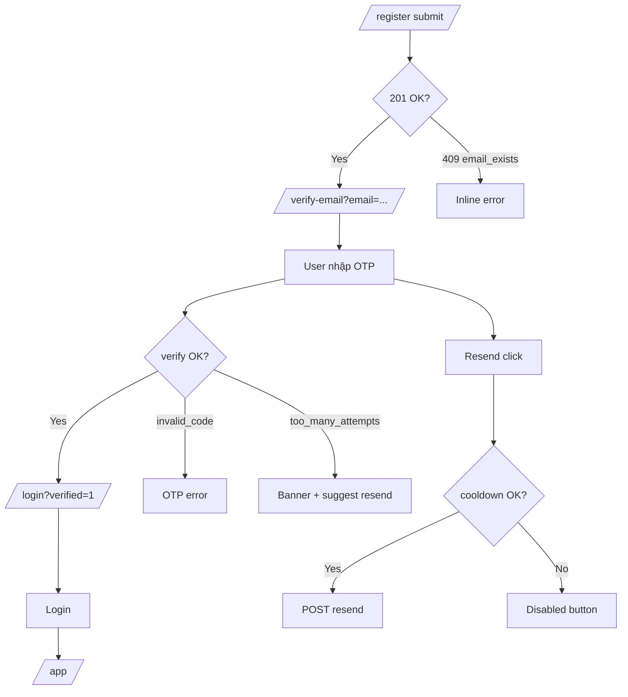

# 06 — Email Verification UI

> Màn hình xác thực email OTP 6 số — align Backend as-built.
>
> **Backend reference:** [Backend 06-email-verification.md](../../Backend/auth/06-email-verification.md)

---

## 1. Tóm tắt quyết định

| Quyết định | UI implementation |
|------------|-------------------|
| Register không auto-login | Redirect `/verify-email` — không expect cookies |
| OTP 6 số | `OtpInput` — numeric, 6 chars |
| Login blocked khi chưa verify | Login form handle `403 email_not_verified` |
| Resend rate limit | Client cooldown 60s + server 3/giờ |
| Dev email | Hướng dẫn mở Mailpit `localhost:8025` trong dev banner |

---

## 2. User flow diagram



---

## 3. Route `/verify-email`

### 3.1 Query params

| Param | Required | Mô tả |
|-------|----------|-------|
| `email` | Khuyến nghị | Pre-fill, hiển thị "gửi đến {email}" |

Nếu thiếu `email` → hiện thêm field email trong form.

### 3.2 Page copy (Vietnamese MVP)

| Element | Text |
|---------|------|
| Title | Xác thực email |
| Description | Nhập mã 6 số chúng tôi đã gửi đến **{email}** |
| Submit | Xác nhận |
| Resend | Gửi lại mã |
| Back link | Quay lại đăng nhập |

### 3.3 Dev helper banner

Chỉ khi `process.env.NODE_ENV === 'development'`:

```
Dev: Mở Mailpit để xem mã OTP → http://localhost:8025
```

---

## 4. VerifyEmailForm behavior

### 4.1 Submit

```typescript
await verifyEmail(email, code);
toast({ title: "Email đã được xác thực" });
router.push(`/login?verified=1&email=${encodeURIComponent(email)}`);
```

### 4.2 Error mapping

| code | UI |
|------|-----|
| `invalid_code` | "Mã không đúng hoặc đã hết hạn" — clear OTP |
| `too_many_attempts` | Alert destructive + disable OTP + highlight resend |
| `already_verified` | Info alert → auto redirect login sau 2s |
| `validation_error` | Field-level (code format) |
| `429` | Toast rate limit |

### 4.3 OTP validation (client zod)

```typescript
const verifySchema = z.object({
  email: z.string().email(),
  code: z.string().regex(/^\d{6}$/, "Mã gồm 6 chữ số"),
});
```

Mirror BE `VerifyEmailRequest` — fail fast trước khi gọi API.

---

## 5. Resend flow

```typescript
async function handleResend() {
  setResendLoading(true);
  try {
    await resendVerification(email);
    toast({ title: "Đã gửi mã mới" });
    startCooldown(60);
  } catch (e) {
    if (e instanceof ApiError && e.status === 429) {
      startCooldown(parseRetryAfter(e) ?? 300);
    }
    throw e;
  } finally {
    setResendLoading(false);
  }
}
```

| Rule | UX |
|------|-----|
| Cooldown 60s minimum | Disable button + countdown |
| Success always generic | Không reveal email có tồn tại không (BE đã handle) |
| After resend | Clear OTP input |

---

## 6. Login integration (`email_not_verified`)

Khi login trả `403 email_not_verified`:

```tsx
<Alert variant="warning">
  <p>Vui lòng xác thực email trước khi đăng nhập.</p>
  <Button variant="link" asChild>
    <Link href={`/verify-email?email=${encodeURIComponent(email)}`}>
      Gửi lại mã xác thực
    </Link>
  </Button>
</Alert>
```

Pre-fill email từ form login state.

---

## 7. Register → verify handoff

**Session storage (optional)** — chỉ UX, không security:

```typescript
// Sau register success — optional fallback nếu mất query param
sessionStorage.setItem("pending_verify_email", email);
// Clear sau verify success hoặc login
```

Ưu tiên query param `?email=` — sessionStorage là backup.

---

## 8. Accessibility (OTP)

| Requirement | Implementation |
|-------------|----------------|
| Label | `aria-label="Mã xác thực 6 số"` |
| Error | `aria-invalid` + `aria-describedby` |
| Input mode | `inputMode="numeric"` `autoComplete="one-time-code"` |
| Paste | Support paste 6 digits từ SMS/email |

---

## 9. Không thuộc MVP

| Feature | Phase |
|---------|-------|
| Magic link "Click to verify" | Phase 2 |
| QR code | — |
| Voice OTP | — |
| Change email trước verify | Phase 2 |
| Countdown TTL 15 phút hiển thị | Nice-to-have P1.1 |

---

## 10. Test scenarios (manual)

| # | Scenario | Expected |
|---|----------|----------|
| 1 | Register → auto redirect verify | Email hiển thị, no cookies |
| 2 | Nhập đúng OTP | → login với banner verified |
| 3 | Nhập sai OTP 5 lần | `too_many_attempts` |
| 4 | Resend trong cooldown | Button disabled |
| 5 | Login chưa verify | `email_not_verified` alert |
| 6 | Verify email đã verified | `already_verified` → login |
| 7 | Dev Mailpit | OTP đọc được từ inbox |
