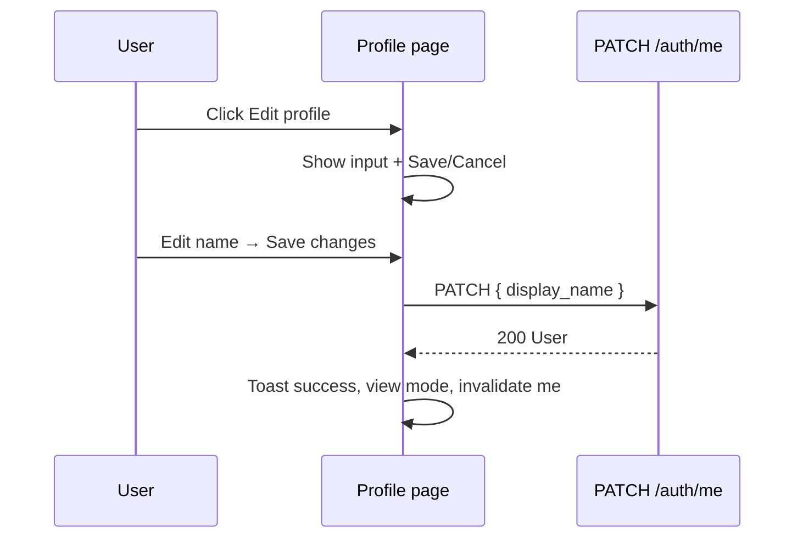
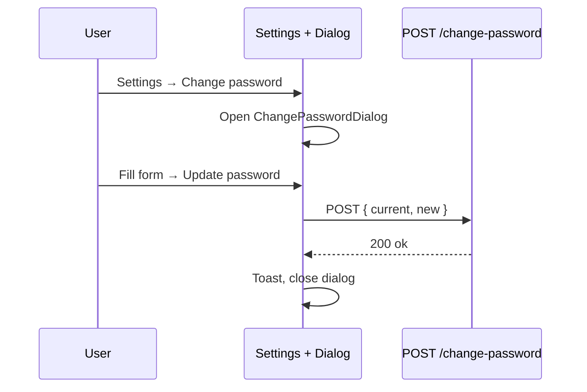
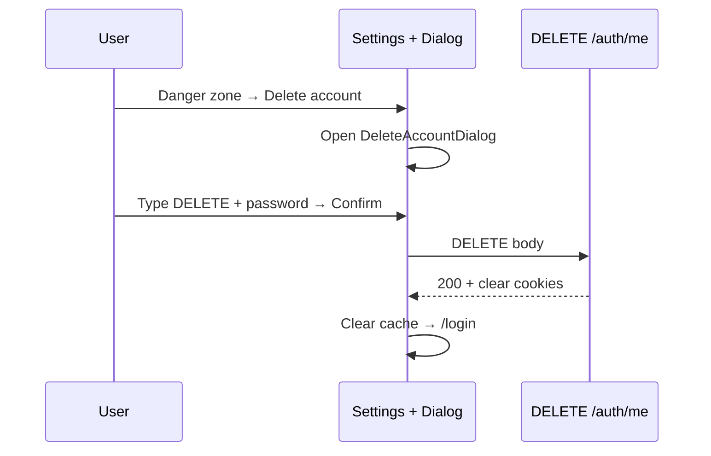

# 10 — Account Management (Profile CRUD, Change Password, Delete Account)

> Plan Phase 2 cho **quản lý tài khoản** sau Auth MVP — Profile CRUD, đổi mật khẩu, xóa tài khoản.
>
> **Phụ thuộc:** Auth MVP hoàn thành — [08-checklist.md](./08-checklist.md) | Backend endpoints mới — xem [§5](#5-backend-api-planned)
>
> **As-built MVP (read-only profile):** [03-pages-components.md](./03-pages-components.md) §7

---

## 1. Tổng quan

| Tính năng | Mô tả ngắn | Trang chính | Backend (hiện tại) |
|-----------|------------|-------------|---------------------|
| **Profile Read** | Xem email, display name, verified badge, member since | `/app/profile` | `GET /v1/auth/me` ✅ |
| **Profile Update** | Sửa `display_name` | `/app/profile` | `PATCH /v1/auth/me` ⬜ |
| **Change password** | Đổi mật khẩu khi đã đăng nhập | `/app/settings` (dialog) | `POST /v1/auth/change-password` ⬜ |
| **Delete account** | Xóa vĩnh viễn tài khoản + dữ liệu | `/app/settings` (dialog) | `DELETE /v1/auth/me` ⬜ |

**Không thuộc Phase 2.1 (defer):**

| Tính năng | Lý do defer | Phase đề xuất |
|-----------|-------------|---------------|
| Đổi email | Cần OTP re-verify, conflict với login identity | 2.2 |
| Avatar upload | Cần storage (S3/local) + crop UI | 2.2 / UX Phase 3 |
| Forgot password | Flow guest (email reset link) — khác change password | Auth Phase 2 riêng |

---

## 2. Nguyên tắc UX & IA

| Nguyên tắc | Áp dụng |
|------------|---------|
| **Profile = thông tin cá nhân** | Read + edit display name — không đặt hành động phá hủy |
| **Settings = bảo mật & phiên** | Change password, sign out, delete account |
| **Destructive tách biệt** | Delete account nằm **Danger zone** — xa Edit profile |
| **Xác nhận 2 bước** | Delete: nhập lại password + gõ `DELETE` hoặc email |
| **Không route thừa** | Change password & delete dùng **Dialog** — không thêm `/settings/password` MVP Phase 2 |

---

## 3. Bản đồ vị trí button & navigation

### 3.1 Sidebar (app shell)

Vị trí: `app/app/layout.tsx` — nav cố định bên trái (đã có).

| Nav item | Route | Vai trò |
|----------|-------|---------|
| Home | `/app` | Dashboard placeholder |
| **Profile** | `/app/profile` | Xem / sửa thông tin cá nhân |
| **Settings** | `/app/settings` | Bảo mật, đăng xuất, xóa tài khoản |

> Sidebar **không** có button Change password hay Delete — chỉ link tới trang. Hành động nằm trong nội dung trang Settings / Profile.

### 3.2 `/app/profile` — Profile CRUD

```
┌─────────────────────────────────────────────────────────────────┐
│  Profile                                    [ Edit profile ]    │  ← §3.2.1
│  Your account information.                                      │
├─────────────────────────────────────────────────────────────────┤
│  ┌─ Profile card ────────────────────────────────────────────┐  │
│  │  Email          user@example.com  [Verified]              │  │  ← read-only
│  │  Display name   Kim Tien          (hoặc input khi edit)   │  │  ← §3.2.2
│  │  Member since   Jun 22, 2026                              │  │  ← read-only
│  └───────────────────────────────────────────────────────────┘  │
│                                                                 │
│  (edit mode — thay [ Edit profile ] bằng:)                      │
│                              [ Cancel ]  [ Save changes ]       │  ← §3.2.3
└─────────────────────────────────────────────────────────────────┘
```

#### §3.2.1 Button `Edit profile`

| Thuộc tính | Giá trị |
|------------|--------|
| **Vị trí** | Góc phải header hàng tiêu đề (`flex justify-between`) |
| **Variant** | `outline` |
| **Label** | `Edit profile` |
| **Khi click** | Chuyển card sang edit mode — chỉ field `display_name` editable |
| **Ẩn khi** | Đang `submitting` hoặc đã ở edit mode |

#### §3.2.2 Field edit mode

| Field | Editable | Component |
|-------|----------|-----------|
| Email | ✗ | Text + badge (link "Verify" nếu chưa verified → `/verify-email`) |
| Display name | ✓ | `Input` max 100 chars |
| Member since | ✗ | Formatted date |

#### §3.2.3 Buttons `Cancel` / `Save changes`

| Button | Vị trí | Variant | Hành vi |
|--------|--------|---------|---------|
| **Cancel** | Header phải (thay Edit) | `ghost` | Reset form → view mode |
| **Save changes** | Header phải, sau Cancel | `default` | `PATCH /me` → toast success → invalidate `['auth','me']` |

**CRUD mapping:**

| CRUD | UI | API |
|------|-----|-----|
| **Create** | Register flow (đã có) | `POST /auth/register` |
| **Read** | Profile page view mode | `GET /auth/me` |
| **Update** | Edit profile → Save | `PATCH /auth/me` |
| **Delete** | *Không trên Profile* | Xem Settings §3.3 |

### 3.3 `/app/settings` — Security & Danger zone

```
┌─────────────────────────────────────────────────────────────────┐
│  Settings                                                       │
│  Manage your account and app preferences.                       │
├─────────────────────────────────────────────────────────────────┤
│  ┌─ Profile ─────────────────────────────────────────────────┐  │
│  │  View and edit your display name and email status.        │  │
│  │                                    [ Go to profile → ]     │  │  ← §3.3.1 link
│  └───────────────────────────────────────────────────────────┘  │
│                                                                 │
│  ┌─ Security ────────────────────────────────────────────────┐  │
│  │  Update your password to keep your account secure.         │  │
│  │                                    [ Change password ]     │  │  ← §3.3.2
│  └───────────────────────────────────────────────────────────┘  │
│                                                                 │
│  ┌─ Session ─────────────────────────────────────────────────┐  │
│  │  Sign out of this device.                                  │  │
│  │                                    [ Sign out ]            │  │  ← §3.3.3 (đã có)
│  └───────────────────────────────────────────────────────────┘  │
│                                                                 │
│  ┌─ Danger zone (border-destructive/30) ─────────────────────┐  │
│  │  Permanently delete your account and all associated data.  │  │
│  │  This action cannot be undone.                             │  │
│  │                                    [ Delete account ]      │  │  ← §3.3.4
│  └───────────────────────────────────────────────────────────┘  │
└─────────────────────────────────────────────────────────────────┘
```

#### §3.3.1 Link `Go to profile`

| Thuộc tính | Giá trị |
|------------|--------|
| **Vị trí** | Card **Profile** — góc phải |
| **Component** | `Button variant="outline"` hoặc `Link` styled as button |
| **Hành vi** | `router.push('/app/profile')` |

#### §3.3.2 Button `Change password`

| Thuộc tính | Giá trị |
|------------|--------|
| **Vị trí** | Card **Security** — góc phải |
| **Variant** | `outline` |
| **Khi click** | Mở `ChangePasswordDialog` (modal centered) |

**ChangePasswordDialog** — buttons bên trong dialog:

| Button | Vị trí trong dialog | Variant |
|--------|---------------------|---------|
| **Cancel** | Footer trái | `ghost` |
| **Update password** | Footer phải | `default` |

Form fields trong dialog:

| Field | Type | Validation |
|-------|------|------------|
| Current password | `password` | required |
| New password | `password` | min 8, 1 letter, 1 digit |
| Confirm new password | `password` | must match new |

Success → toast "Password updated" → đóng dialog → (optional) không logout — session vẫn valid.

#### §3.3.3 Button `Sign out`

| Thuộc tính | Giá trị |
|------------|--------|
| **Vị trí** | Card **Session** — góc phải |
| **Variant** | `destructive` |
| **Trạng thái** | Đã implement MVP |

#### §3.3.4 Button `Delete account`

| Thuộc tính | Giá trị |
|------------|--------|
| **Vị trí** | Card **Danger zone** — góc phải |
| **Variant** | `destructive` + `outline` (hoặc `destructive` solid — chọn **outline** để phân biệt Sign out) |
| **Khi click** | Mở `DeleteAccountDialog` |

**DeleteAccountDialog** — confirmation nghiêm ngặt:

```
┌─ Delete account ─────────────────────────────────────┐
│  This will permanently delete your account and       │
│  all dashboards. This cannot be undone.              │
│                                                      │
│  Type DELETE to confirm:                             │
│  [ ________________ ]                                │
│                                                      │
│  Enter your password:                                │
│  [ password         ]                                │
│                                                      │
│              [ Cancel ]    [ Delete my account ]     │
└──────────────────────────────────────────────────────┘
```

| Button | Vị trí | Variant | Enabled khi |
|--------|--------|---------|-------------|
| **Cancel** | Footer trái | `ghost` | always |
| **Delete my account** | Footer phải | `destructive` | `confirmText === 'DELETE'` + password filled + not submitting |

Success → `logout()` → clear cache → redirect `/login` + toast "Account deleted".

---

## 4. Component tree (mới)

```
modules/auth/
├── components/
│   ├── ProfileCard.tsx              # Read view — dl rows
│   ├── ProfileEditForm.tsx          # Edit display_name
│   ├── ChangePasswordDialog.tsx     # Modal + form
│   ├── DeleteAccountDialog.tsx      # Modal + confirm + password
│   └── SettingsSection.tsx          # Optional — card wrapper tái dùng
├── hooks/
│   ├── useUpdateProfile.ts          # useMutation PATCH /me
│   ├── useChangePassword.ts         # useMutation POST change-password
│   └── useDeleteAccount.ts          # useMutation DELETE /me
└── schemas/
    ├── profile.schema.ts            # display_name zod
    ├── change-password.schema.ts
    └── delete-account.schema.ts
```

**Pages (thin):**

| File | Compose |
|------|---------|
| `app/app/profile/page.tsx` | `useMe` + toggle view/edit + `ProfileCard` / `ProfileEditForm` |
| `app/app/settings/page.tsx` | Section cards + dialogs + existing logout |

---

## 5. Backend API (planned)

> **Blocker:** Backend chưa có endpoints dưới đây — cần plan + implement trước hoặc song song UI.
>
> Đề xuất thêm vào `plan/phases/Backend/auth/` khi implement.

### 5.1 PATCH `/v1/auth/me`

**Auth:** Required (access cookie)

**Request:**
```json
{
  "display_name": "Kim Tien"
}
```

**Response `200`:**
```json
{
  "id": "...",
  "email": "user@example.com",
  "display_name": "Kim Tien",
  "email_verified": true,
  "created_at": "2026-06-22T00:00:00Z"
}
```

**Errors:**

| Status | code | UI |
|--------|------|-----|
| 400 | `validation_error` | Inline display_name |
| 401 | `token_*` | Redirect login |

### 5.2 POST `/v1/auth/change-password`

**Request:**
```json
{
  "current_password": "oldpass123",
  "new_password": "newpass456"
}
```

**Response `200`:** `{ "ok": true }`

**Errors:**

| Status | code | UI |
|--------|------|-----|
| 400 | `validation_error` | Inline new_password |
| 401 | `invalid_credentials` | current_password field error |
| 429 | rate limit | Toast + disable submit |

**Rules:** `new_password` ≠ `current_password` (server-side); strength giống register.

### 5.3 DELETE `/v1/auth/me`

**Request:**
```json
{
  "password": "currentpass123",
  "confirmation": "DELETE"
}
```

**Response `200`:** `{ "ok": true }` + clear auth cookies

**Server-side:** Soft-delete `is_active=false` hoặc hard-delete cascade tasks — quyết định BE; FE chỉ cần `ok`.

**Errors:**

| Status | code | UI |
|--------|------|-----|
| 401 | `invalid_credentials` | password field |
| 400 | `validation_error` | confirmation field |

---

## 6. API client (`lib/api/auth.ts`)

| Function | Method | Path |
|----------|--------|------|
| `updateProfile` | PATCH | `/auth/me` |
| `changePassword` | POST | `/auth/change-password` |
| `deleteAccount` | DELETE | `/auth/me` |

Tất cả qua `fetchWithAuth`. Sau `updateProfile` success → `queryClient.setQueryData(['auth','me'], user)`.

Sau `deleteAccount` → `queryClient.clear()` + `authStore.clear()` — không cần gọi logout riêng nếu BE đã clear cookies.

---

## 7. User flows

### 7.1 Update display name



### 7.2 Change password



### 7.3 Delete account



---

## 8. Validation (zod)

### 8.1 `profile.schema.ts`

```typescript
export const updateProfileSchema = z.object({
  display_name: z
    .string()
    .trim()
    .min(1, "Display name is required")
    .max(100, "Max 100 characters"),
});
```

### 8.2 `change-password.schema.ts`

```typescript
export const changePasswordSchema = z
  .object({
    current_password: z.string().min(1, "Current password is required"),
    new_password: z
      .string()
      .min(8)
      .regex(/[a-zA-Z]/, "Must contain a letter")
      .regex(/\d/, "Must contain a digit"),
    confirm_password: z.string(),
  })
  .refine((d) => d.new_password === d.confirm_password, {
    message: "Passwords do not match",
    path: ["confirm_password"],
  })
  .refine((d) => d.new_password !== d.current_password, {
    message: "New password must differ from current",
    path: ["new_password"],
  });
```

### 8.3 `delete-account.schema.ts`

```typescript
export const deleteAccountSchema = z.object({
  confirmation: z.literal("DELETE", {
    errorMap: () => ({ message: 'Type DELETE to confirm' }),
  }),
  password: z.string().min(1, "Password is required"),
});
```

---

## 9. Error & toast copy (EN — align implementation)

| Event | Toast / UI |
|-------|------------|
| Profile updated | "Profile updated" |
| Password updated | "Password updated" |
| Account deleted | "Your account has been deleted" |
| Wrong current password | Inline on password field |
| Rate limit | "Too many requests — try again in {n}s" |

---

## 10. Design notes

| Element | Guideline |
|---------|-----------|
| Settings sections | `Card` hoặc `rounded-lg border` — spacing `space-y-6` |
| Danger zone | `border-destructive/30`, title `text-destructive` |
| Dialogs | `Dialog` shadcn — max-w-md, focus trap |
| Delete confirm | Input `confirmation` — `autoComplete="off"` |
| Mobile | Buttons full-width trong dialog footer `< sm` |

Chi tiết visual: [07-design-ux.md](./07-design-ux.md) §11 (cập nhật).

---

## 11. Thứ tự implement đề xuất

1. **Backend:** PATCH `/me`, POST `/change-password`, DELETE `/me` + tests
2. **FE API:** `auth.ts` + error codes
3. **Schemas + hooks:** mutations + invalidate
4. **Profile:** `ProfileEditForm` + Edit/Save/Cancel trên `/app/profile`
5. **Settings:** Security card + `ChangePasswordDialog`
6. **Settings:** Danger zone + `DeleteAccountDialog`
7. **Manual QA:** scenarios §12
8. Cập nhật [09-implementation-status.md](./09-implementation-status.md)

**Branch đề xuất:** `feature/account-management` từ `develop`

**Estimate:** ~1.5–2 ngày (BE 0.5–1 + FE 1)

---

## 12. Manual test scenarios

| # | Scenario | Expected |
|---|----------|----------|
| 17 | Edit display name → Save | PATCH 200, UI updates, toast |
| 18 | Edit → Cancel | Reverts, no API call |
| 19 | Change password success | Dialog closes, toast, still logged in |
| 20 | Change password wrong current | 401 inline error |
| 21 | New password weak | 400 inline validation |
| 22 | Delete account — wrong password | 401, stay on dialog |
| 23 | Delete account — confirmation not DELETE | Submit disabled |
| 24 | Delete account success | Redirect `/login`, cannot `/app` |
| 25 | Update profile then refresh | Name persists |
| 26 | Go to profile from Settings | Navigates correctly |

---

## 13. Definition of done (Phase 2.1)

1. User sửa display name từ Profile — persist qua refresh
2. User đổi password từ Settings dialog — session vẫn hoạt động
3. User xóa account từ Danger zone — logout + không truy cập được `/app`
4. Mọi button/action đúng vị trí theo §3
5. Manual tests **17–26** pass
6. Backend + FE docs sync

---

## 14. Cross-references

| Doc | Liên quan |
|-----|-----------|
| [03-pages-components.md](./03-pages-components.md) | MVP Profile/Settings §7 |
| [04-api-integration.md](./04-api-integration.md) | Client patterns |
| [Backend 04-api-contracts.md](../../Backend/auth/04-api-contracts.md) | Thêm contracts khi BE ready |
| [UI/UX phase-3-polish-scale.md](../UX/phase-3-polish-scale.md) | Avatar, email change (later) |
