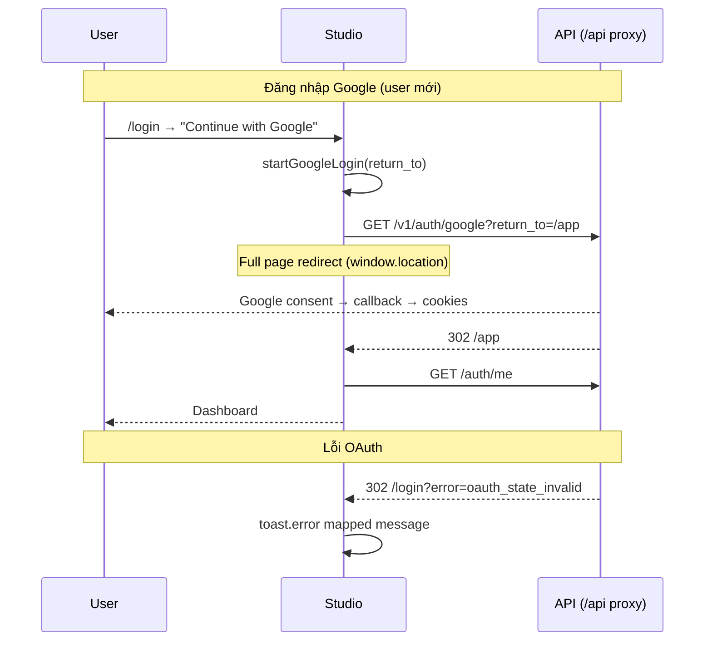

# 11 — Google OAuth (Studio UI)

> **Trạng thái:** Planned
>
> **Master plan:** [`../../../google-oauth-login.md`](../../../google-oauth-login.md)
>
> **Backend:** [08-google-oauth.md](../../Backend/auth/08-google-oauth.md)
>
> **Phụ thuộc:** Auth UI MVP done ([09-implementation-status.md](./09-implementation-status.md)), same-origin `/api` proxy prod

---

## 1. User journeys



### Bảng journey → UI

| # | Journey | Route | Hành vi UI |
|---|---------|-------|------------|
| G1 | Google login từ login | `/login` | Nút secondary → full redirect |
| G2 | Google signup từ register | `/register` | Cùng nút — Google vừa login vừa signup |
| G3 | OAuth success | `/app` | `AuthGuard` load me như login thường |
| G4 | OAuth error | `/login?error=...` | Toast + giữ form password |
| G5 | OAuth-only settings | `/app/settings` | Ẩn "Change password" |
| G6 | OAuth-only delete | `/app/settings` | Dialog không có field password |

---

## 2. Component changes

### 2.1 `GoogleSignInButton` (mới)

Path: `apps/studio/modules/auth/components/GoogleSignInButton.tsx`

```tsx
type Props = {
  returnTo?: string;
  label?: string; // default: "Continue with Google"
};

export function GoogleSignInButton({ returnTo, label }: Props) {
  function handleClick() {
    startGoogleLogin(returnTo ?? safeReturnToFromPage());
  }
  return (
    <Button type="button" variant="outline" className="w-full" onClick={handleClick}>
      <GoogleIcon className="mr-2 h-4 w-4" />
      {label}
    </Button>
  );
}
```

**Design:**

- Full width, `variant="outline"` — dưới divider "or continue with email"
- Icon Google official colors (SVG inline, không CDN ngoài)
- a11y: `aria-label="Continue with Google"`

### 2.2 `LoginForm.tsx` / `RegisterForm.tsx`

Thêm sau submit button hoặc trước form:

```tsx
<GoogleSignInButton returnTo={safeReturnTo(searchParams?.get("return_to"))} />
<div className="relative my-4">
  <span className="bg-background px-2 text-muted-foreground text-xs uppercase">
    or continue with email
  </span>
</div>
```

**Feature flag FE:**

```typescript
// lib/api/config.ts
export const googleOAuthEnabled =
  process.env.NEXT_PUBLIC_GOOGLE_OAUTH_ENABLED === "true";
```

Ẩn nút khi `false` — khớp backend `GOOGLE_OAUTH_ENABLED`.

### 2.3 OAuth error handling — `LoginPage`

`apps/studio/app/(auth)/login/page.tsx`:

```typescript
const OAUTH_ERROR_MESSAGES: Record<string, string> = {
  oauth_state_invalid: "Sign-in expired. Please try again.",
  oauth_exchange_failed: "Could not complete Google sign-in. Try again later.",
  google_email_unverified: "Your Google email is not verified.",
  account_exists_password:
    "An account with this email already exists. Sign in with your password first.",
};
```

`useEffect` đọc `searchParams.get("error")` → `toast.error(...)`, `router.replace` xóa query.

---

## 3. API integration

### 3.1 `lib/api/auth.ts`

```typescript
import { resolveApiUrl } from "./config";

export function startGoogleLogin(returnTo = "/app"): void {
  const params = new URLSearchParams({ return_to: returnTo });
  window.location.assign(resolveApiUrl(`/v1/auth/google?${params}`));
}
```

**Không dùng `fetch`** — cần full navigation để follow Google redirects.

### 3.2 `resolveApiUrl` behavior

| Env | URL |
|-----|-----|
| Dev | `http://localhost:8000/v1/auth/google?...` |
| Prod | `/api/v1/auth/google?...` (same-origin proxy) |

Proxy (`pages/api/[...path].ts`) forward GET tới Render — **302 redirects từ Google phải về callback URI đã đăng ký** (thường là Render trực tiếp, không qua proxy). Sau callback, API redirect về Studio `/app` — không qua proxy.

### 3.3 Types (`modules/auth/types/auth.ts`)

```typescript
export interface User {
  ...
  has_password: boolean;
  auth_providers: ("password" | "google")[];
}
```

---

## 4. Session sau OAuth

**Không cần code mới** nếu callback set cookies đúng domain:

1. User land `/app`
2. `AuthGuard` → `useMe()` → `GET /auth/me` với `credentials: include`
3. `authStore.setUser` — giống `useLogin` success

**Optional:** `login/page.tsx` detect `?oauth=1` success toast — không bắt buộc vì redirect thẳng `/app`.

---

## 5. Settings & account management

### 5.1 Change password (`SettingsSection.tsx` / `ChangePasswordDialog.tsx`)

```tsx
{user.has_password && (
  <ChangePasswordDialog ... />
)}
```

OAuth-only: hiện copy "You signed in with Google. Set a password to enable email login." — **Phase 2** (`POST /auth/set-password`).

### 5.2 Delete account (`DeleteAccountDialog.tsx`)

| `has_password` | Form |
|----------------|------|
| `true` | Password + type DELETE |
| `false` | Chỉ type DELETE |

```typescript
const deleteSchema = z.object({
  confirmation: z.literal("DELETE"),
  password: user.has_password
    ? z.string().min(1, "Password required")
    : z.string().optional(),
});
```

### 5.3 Profile (`ProfileCard.tsx`)

Optional badge: "Google account" nếu `auth_providers.includes("google")` — Phase 2 polish.

---

## 6. Auth layout UX

`AuthLayout.tsx` — không đổi structure.

**Mobile:** Nút Google full width, min height 44px touch target.

**Loading state:** Disable Google button khi `loginMutation.isPending` — tránh double navigation.

---

## 7. Không cần callback page FE

Callback xử lý **hoàn toàn backend** → redirect `/app` hoặc `/login?error=`.

**Không tạo** `app/(auth)/google/callback/page.tsx` trong v1.

---

## 8. Env vars (Studio)

```bash
# .env.local.example
NEXT_PUBLIC_GOOGLE_OAUTH_ENABLED=true
```

Chỉ public flag — **không** đặt `GOOGLE_CLIENT_SECRET` trên Vercel.

---

## 9. E2E tests (optional v1)

`apps/studio/e2e/google-auth.spec.ts` — **skip** trong CI (cần Google thật).

Smoke thủ công:

1. Prod/staging: click Google → consent → `/app`
2. Dev: Mailpit/console không liên quan
3. Logout → login lại Google

**Playwright mock:** Không khả thi full OAuth — backend tests đủ coverage.

---

## 10. File tracker

| File | Action |
|------|--------|
| `modules/auth/components/GoogleSignInButton.tsx` | Create |
| `modules/auth/components/LoginForm.tsx` | Modify |
| `modules/auth/components/RegisterForm.tsx` | Modify |
| `modules/auth/components/DeleteAccountDialog.tsx` | Modify |
| `modules/settings/components/SettingsSection.tsx` | Modify |
| `modules/auth/types/auth.ts` | Modify |
| `lib/api/auth.ts` | Add `startGoogleLogin` |
| `lib/api/config.ts` | Add `googleOAuthEnabled` |
| `app/(auth)/login/page.tsx` | OAuth error toast |
| `apps/studio/.env.local.example` | Add `NEXT_PUBLIC_GOOGLE_OAUTH_ENABLED` |
| `modules/auth/index.ts` | Export `GoogleSignInButton` |

---

## 11. Design reference

| Element | Token |
|---------|-------|
| Google button border | `border-input` |
| Divider text | `text-muted-foreground text-xs` |
| Error toast | sonner `toast.error` — giống login errors |

Align [07-design-ux.md](./07-design-ux.md) — không dùng gradient flashy trên OAuth button.

---

## 12. Definition of Done (UI)

- [ ] Nút Google trên `/login` và `/register`
- [ ] Ẩn nút khi `NEXT_PUBLIC_GOOGLE_OAUTH_ENABLED=false`
- [ ] OAuth errors hiển thị toast trên `/login`
- [ ] OAuth-only user không thấy change password
- [ ] Delete account OAuth-only không yêu cầu password
- [ ] `has_password` / `auth_providers` typed trong `User`
- [ ] Manual QA prod proxy + cookies
