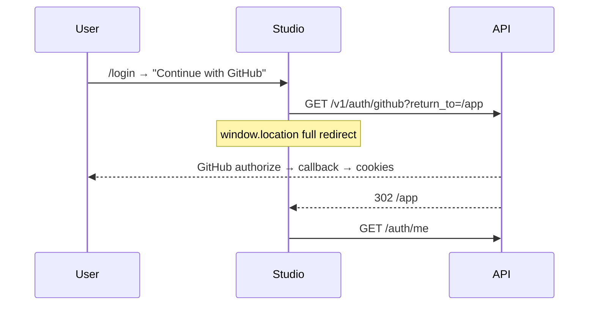

# 12 — GitHub OAuth (Studio UI)

> **Trạng thái:** Planned
>
> **Master plan:** [`../../../github-oauth-login.md`](../../../github-oauth-login.md)
>
> **Backend:** [10-github-oauth.md](../../Backend/auth/10-github-oauth.md)
>
> **Reference UI (Google Done):** [11-google-oauth.md](./11-google-oauth.md)

---

## 1. User journeys



| # | Journey | Route | Hành vi |
|---|---------|-------|---------|
| H1 | GitHub login | `/login` | Nút GitHub → redirect |
| H2 | GitHub signup | `/register` | Cùng nút |
| H3 | Success | `/app` | AuthGuard + cookies |
| H4 | No verified email | `/login?error=github_email_unavailable` | Toast hướng dẫn |
| H5 | OAuth-only settings | `/app/settings` | Đã xử lý (Google v1) |

---

## 2. Components

### 2.1 `GitHubSignInButton` (mới)

Path: `apps/studio/modules/auth/components/GitHubSignInButton.tsx`

```tsx
type Props = {
  returnTo?: string;
  disabled?: boolean;
};

export function GitHubSignInButton({ returnTo = "/app", disabled }: Props) {
  if (!githubOAuthEnabled) return null;
  return (
    <Button variant="outline" className="w-full" onClick={() => startGitHubLogin(returnTo)}>
      <GitHubIcon />
      Continue with GitHub
    </Button>
  );
}
```

**Design:**

- `variant="outline"` — đồng bộ Google button
- Icon GitHub monochrome (SVG inline)
- Full width, min-height 44px mobile

### 2.2 Layout Login / Register

**Option A (khuyến nghị):** Stack vertical

```
[ Continue with Google  ]
[ Continue with GitHub  ]
──── or continue with email ────
[ email form...         ]
```

**Option B:** Two columns desktop — không khuyến nghị v1 (mobile phức tạp).

Files:

- `LoginForm.tsx` — thêm `<GitHubSignInButton returnTo={returnTo} />` dưới Google
- `RegisterForm.tsx` — tương tự

---

## 3. API integration

### 3.1 `lib/api/auth.ts`

```typescript
export const githubOAuthEnabled =
  process.env.NEXT_PUBLIC_GITHUB_OAUTH_ENABLED === "true";

export function startGitHubLogin(returnTo = "/app"): void {
  const params = new URLSearchParams({ return_to: returnTo });
  window.location.assign(resolveApiUrl(`/v1/auth/github?${params}`));
}
```

### 3.2 Types

```typescript
export type AuthProvider = "password" | "google" | "github";
```

Backend `UserResponse.auth_providers` đã hỗ trợ sau backend deploy.

---

## 4. Error handling — `LoginForm.tsx`

Mở rộng `OAUTH_ERROR_MESSAGES`:

```typescript
const OAUTH_ERROR_MESSAGES: Record<string, string> = {
  // ... existing Google errors ...
  github_email_unavailable:
    "GitHub did not provide a verified email. Add a verified primary email in GitHub settings, then try again.",
};
```

`useEffect` đọc `searchParams.get("error")` — **đã có** từ Google v1.

---

## 5. Env vars (Studio)

```bash
# apps/studio/.env.local
NEXT_PUBLIC_GITHUB_OAUTH_ENABLED=true
```

Production Vercel — set trong dashboard.

---

## 6. Feature flags matrix

| Env | Google button | GitHub button |
|-----|---------------|---------------|
| `NEXT_PUBLIC_GOOGLE_OAUTH_ENABLED=true` | Show | — |
| `NEXT_PUBLIC_GITHUB_OAUTH_ENABLED=true` | — | Show |
| Both true | Both show | Both show |
| Both false | Hide | Hide |

Backend flags độc lập — nếu FE show nhưng BE off → redirect error `oauth_provider_disabled`.

---

## 7. Settings / Account (không đổi v1)

| Case | UI |
|------|-----|
| `has_password=false` | Ẩn Change password (Done) |
| `auth_providers: ["google","github"]` | Optional badge Phase 2 |
| Delete account OAuth-only | Chỉ cần type DELETE (Done) |

Phase 2: Settings panel "Connected accounts" — link/unlink Google & GitHub.

---

## 8. Accessibility

- `aria-label="Continue with GitHub"`
- Disable cả Google + GitHub khi form submit pending
- Error toast có link docs (optional): GitHub email settings help URL

---

## 9. E2E

Manual QA checklist (không Playwright v1 — cần GitHub thật):

1. Local: click GitHub → authorize → `/app`
2. User ẩn email → toast `github_email_unavailable`
3. Prod: proxy callback + cookies
4. User đã login Google → login GitHub same email → single account

---

## 10. File tracker

| File | Action |
|------|--------|
| `modules/auth/components/GitHubSignInButton.tsx` | Create |
| `modules/auth/components/LoginForm.tsx` | Modify |
| `modules/auth/components/RegisterForm.tsx` | Modify |
| `modules/auth/types/auth.ts` | Add `"github"` to AuthProvider |
| `lib/api/auth.ts` | Add `startGitHubLogin`, `githubOAuthEnabled` |
| `apps/studio/.env.local.example` | Add `NEXT_PUBLIC_GITHUB_OAUTH_ENABLED` |
| `modules/auth/index.ts` | Export `GitHubSignInButton` |

---

## 11. Definition of Done (UI)

- [ ] Nút GitHub trên `/login` và `/register`
- [ ] Ẩn khi `NEXT_PUBLIC_GITHUB_OAUTH_ENABLED=false`
- [ ] Error `github_email_unavailable` hiển thị toast rõ ràng
- [ ] Layout không vỡ mobile với 2 OAuth buttons
- [ ] Manual QA local + prod
