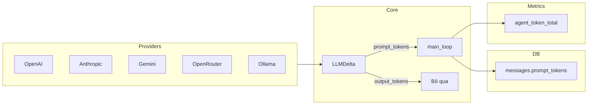
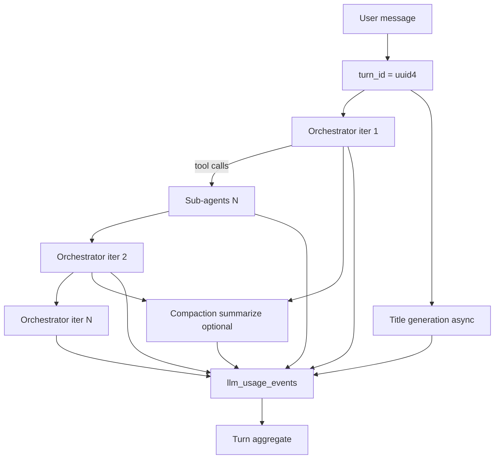

# Token Usage Tracking — Master Plan

> **Tính năng:** Đếm token chuẩn (input + output) khi chat, theo turn / conversation / account lifetime; hiển thị cạnh Thinking và trong Settings.
>
> **Trạng thái:** Planned
>
> **Ngày lập:** 2026-06-29
>
> **Chi tiết triển khai:**
> - Backend → [`phases/Backend/usage/01-token-usage-backend.md`](./phases/Backend/usage/01-token-usage-backend.md)
> - Frontend → [`phases/UI/usage/02-token-usage-ui.md`](./phases/UI/usage/02-token-usage-ui.md)
> - Checklist → [`phases/Backend/usage/03-token-usage-checklist.md`](./phases/Backend/usage/03-token-usage-checklist.md)

---

## 1. Tóm tắt

DashZen đã có **nền tảng token một phần**:

- LLM providers trả `prompt_tokens` + `output_tokens` qua `LLMDelta` khi stream
- Cột `messages.prompt_tokens` lưu per orchestrator iteration
- `main_loop.py` cộng dồn prompt tokens cho Prometheus (`agent_token_total`)
- Compaction dùng `prompt_tokens` thật để ước lượng context budget

**Chưa có:** lưu output tokens, đếm sub-agent / compaction / title, aggregate per turn / task / user, stream event cho FE, UI hiển thị.

### Mục tiêu sản phẩm

| Mục tiêu | Mô tả |
|----------|-------|
| **Chuẩn billing-grade** | Số liệu từ provider usage metadata — không ước lượng client-side |
| **Input + Output** | Hiển thị riêng cả hai; tổng = input + output |
| **Per response (turn)** | Một lần user gửi message → assistant hoàn thành |
| **Per conversation** | Tổng token trong một task (conversation) |
| **Per account lifetime** | Tổng từ khi tạo tài khoản — hiển thị trong Settings |
| **UI unobtrusive** | Cạnh chữ "Thinking" (Gemini-style), monospace muted |

### Out of scope (v1)

| Out of scope | Ghi chú |
|--------------|---------|
| Billing / quota / hard limits | Chỉ tracking + display; không chặn user |
| Chart usage theo ngày | Phase 2 — cần time-series query |
| Per-model breakdown trong UI | Có trong `llm_usage_events`; UI v1 chỉ tổng |
| Token cost ($) | Cần pricing table per model — Phase 2 |
| Admin dashboard usage | Internal ops — Phase 2 |
| tiktoken local counting | Provider usage đủ cho v1 |
| Export CSV usage | Phase 2 |

---

## 2. Hiện trạng (as-built)

### 2.1 Data flow hiện tại



### 2.2 File map liên quan

| File | Vai trò hiện tại |
|------|------------------|
| `packages/core/src/core/llm/types.py` | `LLMDelta` có `prompt_tokens`, `output_tokens` |
| `packages/core/src/core/llm/providers/*.py` | Parse usage từ provider response |
| `packages/core/src/core/llm/client.py` | `chat()` chỉ trả `str` — **không có usage** |
| `packages/agents/src/agents/orchestration/main_loop.py` | Lưu `prompt_tokens` per assistant message |
| `packages/agents/src/agents/orchestration/agent_loop.py` | **Không track usage** |
| `packages/agents/src/agents/context/compaction.py` | `client.chat()` summarize — **không track** |
| `packages/agents/src/agents/orchestration/task_title.py` | `client.chat()` title — **không track** |
| `packages/db/src/db/models/message.py` | `prompt_tokens` only |
| `packages/db/src/db/models/user.py` | Không có usage columns |
| `packages/db/src/db/models/task.py` | Không có usage columns |
| `packages/agents/src/agents/streaming/events.py` | Không có usage event |
| `apps/studio/.../ActivityBlocks.tsx` | `ThinkingPanel` — header "Thinking" |
| `apps/studio/.../AccountSettingsPanel.tsx` | Account settings — chưa có usage |

### 2.3 Vấn đề kỹ thuật cần giải quyết

| # | Vấn đề | Hệ quả nếu không fix |
|---|--------|----------------------|
| P1 | `output_tokens` không persist | UI chỉ có input — không đủ "chuẩn" |
| P2 | Một turn = nhiều LLM calls (orchestrator iterations + sub-agents) | SUM `messages.prompt_tokens` **over-count** (mỗi iteration gửi lại full history) |
| P3 | `client.chat()` không trả usage | Compaction + title invisible trong usage |
| P4 | Sub-agent chạy song song | Cần `turn_id` chung + thread-safe accumulate |
| P5 | Stream abort giữa chừng | Phải ghi usage cho calls đã hoàn thành |
| P6 | Ollama có thể thiếu usage | Cho phép `null` → skip event hoặc ghi 0 với flag |

---

## 3. Định nghĩa domain

### 3.1 Thuật ngữ

| Thuật ngữ | Định nghĩa |
|-----------|------------|
| **LLM call** | Một request hoàn chỉnh tới provider (stream hoặc chat) |
| **Turn** | Từ khi user gửi message đến khi `stream_done` (hoặc error/abort) |
| **Conversation** | Một `task` — tập hợp turns |
| **Input tokens** | `prompt_tokens` / `input_tokens` từ provider |
| **Output tokens** | `completion_tokens` / `output_tokens` / `candidatesTokenCount` |
| **Thinking tokens** | Provider-specific — Anthropic tách; OpenAI/Gemini thường gộp vào output |

### 3.2 Nguồn LLM calls trong một turn



### 3.3 Công thức aggregate

```
turn_input  = SUM(event.input_tokens  WHERE turn_id = X)
turn_output = SUM(event.output_tokens WHERE turn_id = X)
turn_total  = turn_input + turn_output

task_input  = users.tasks.total_input_tokens  (denormalized)
user_input  = users.total_input_tokens        (denormalized)
```

**Không** SUM `messages.prompt_tokens` cho turn total — sai semantics.

---

## 4. Quyết định thiết kế

| # | Quyết định | Lựa chọn | Lý do |
|---|------------|----------|-------|
| D1 | Nguồn số liệu | Provider usage metadata | Billing-grade, đã có trong providers |
| D2 | Event log | Bảng `llm_usage_events` | Audit, reconciliation, Phase 2 analytics |
| D3 | Fast read | Denormalized counters trên `users`, `tasks` | Settings O(1), không SUM history |
| D4 | Turn grouping | `turn_id` UUID tạo đầu `main_loop` | Một turn nhiều calls |
| D5 | Persisted UI data | `usage` trong `activity_log` JSON | FE đọc từ message — không join thêm |
| D6 | Live UI data | SSE `usage_update` event | Cập nhật Thinking header khi stream |
| D7 | `client.chat()` | Trả `LLMChatResult(content, usage)` | Breaking change có kiểm soát — 3 call sites |
| D8 | Null usage | Skip record nếu cả input và output đều null | Ollama edge case |
| D9 | Transaction | `record_usage` + counter bump cùng transaction với message commit | Tránh drift |
| D10 | Account scope | `user_id` filter trong mọi service query | Security convention |
| D11 | UI format | `In 12.4K · Out 1.8K` | Khớp mockup Gemini-style |
| D12 | Settings placement | Tab Account, section "Token usage" | Cùng pattern Member since |

---

## 5. Schema DB (migration `010_token_usage`)

### 5.1 Bảng mới: `llm_usage_events`

```sql
CREATE TABLE llm_usage_events (
    id              UUID PRIMARY KEY DEFAULT gen_random_uuid(),
    user_id         UUID NOT NULL REFERENCES users(id) ON DELETE CASCADE,
    task_id         UUID NOT NULL REFERENCES tasks(id) ON DELETE CASCADE,
    turn_id         UUID NOT NULL,
    message_id      UUID NULL REFERENCES messages(id) ON DELETE SET NULL,
    source          VARCHAR(32) NOT NULL,  -- orchestrator | sub_agent | compaction | title
    agent_name      VARCHAR(64) NULL,
    model           VARCHAR(128) NULL,
    input_tokens    INTEGER NOT NULL DEFAULT 0,
    output_tokens   INTEGER NOT NULL DEFAULT 0,
    created_at      TIMESTAMPTZ NOT NULL DEFAULT now()
);

CREATE INDEX ix_llm_usage_user_id ON llm_usage_events (user_id);
CREATE INDEX ix_llm_usage_task_id ON llm_usage_events (task_id);
CREATE INDEX ix_llm_usage_turn_id ON llm_usage_events (turn_id);
CREATE INDEX ix_llm_usage_user_created ON llm_usage_events (user_id, created_at);
```

### 5.2 Cột mới

**`users`:**

```sql
ALTER TABLE users
    ADD COLUMN total_input_tokens  BIGINT NOT NULL DEFAULT 0,
    ADD COLUMN total_output_tokens BIGINT NOT NULL DEFAULT 0;
```

**`tasks`:**

```sql
ALTER TABLE tasks
    ADD COLUMN total_input_tokens  BIGINT NOT NULL DEFAULT 0,
    ADD COLUMN total_output_tokens BIGINT NOT NULL DEFAULT 0;
```

**`messages`:**

```sql
ALTER TABLE messages
    ADD COLUMN output_tokens INTEGER NULL,
    ADD COLUMN turn_id UUID NULL;

CREATE INDEX ix_messages_turn_id ON messages (turn_id);
```

> `messages.prompt_tokens` giữ nguyên — snapshot input của **iteration đó** (phục vụ compaction/debug). Turn aggregate lấy từ `llm_usage_events` hoặc `activity_log.usage`.

### 5.3 Activity log extension (không migration — JSON)

```json
{
  "type": "activity_log",
  "version": 1,
  "header_title": "Dashboard planning",
  "usage": {
    "input_tokens": 12400,
    "output_tokens": 1850
  },
  "sections": []
}
```

Backward compatible: `usage` optional; FE fallback `null` → không hiển thị.

---

## 6. API changes

### 6.1 Endpoints

| Method | Path | Thay đổi |
|--------|------|----------|
| `GET` | `/v1/auth/me` | Thêm `usage: { input_tokens, output_tokens, total_tokens }` |
| `GET` | `/v1/tasks/{id}` | *(optional v1)* Thêm `usage` — hoặc defer |
| `GET` | `/v1/tasks/{id}/messages` | `activity_log.usage` khi có |
| SSE | `/v1/tasks/{id}/stream` | Event `usage_update` mới |

### 6.2 Schemas

**`UserResponse` extension:**

```python
class UsageSummary(BaseModel):
    input_tokens: int = 0
    output_tokens: int = 0

    @computed_field  # type: ignore[prop-decorator]
    @property
    def total_tokens(self) -> int:
        return self.input_tokens + self.output_tokens
```

**`ActivityLogResponse` extension:**

```python
class ActivityLogUsage(BaseModel):
    input_tokens: int
    output_tokens: int
```

**Stream event mới:**

```python
class UsageUpdateEvent(BaseModel):
    type: Literal["usage_update"] = "usage_update"
    turn_input_tokens: int
    turn_output_tokens: int
    delta_input: int
    delta_output: int
```

**`StreamDoneEvent` extension:**

```python
class StreamDoneEvent(BaseModel):
    type: Literal["stream_done"] = "stream_done"
    partial_message_id: str | None = None
    turn_input_tokens: int | None = None
    turn_output_tokens: int | None = None
```

---

## 7. Backend package layout

```
packages/core/src/core/llm/
  types.py              # + LLMUsage, LLMChatResult
  client.py             # Protocol: chat() -> LLMChatResult

packages/db/src/db/
  models/llm_usage_event.py   # NEW
  models/user.py              # + total_* columns
  models/task.py                # + total_* columns
  models/message.py             # + output_tokens, turn_id
  services/usage_service.py     # NEW — record_usage, getters

packages/agents/src/agents/
  orchestration/
    main_loop.py          # turn_id, record usage, emit events
    agent_loop.py         # record sub-agent usage
    task_title.py         # record title usage
    activity_log.py       # ActivityLog.usage field
  context/
    compaction.py         # record compaction usage
  streaming/
    events.py             # UsageUpdateEvent
  usage/                  # NEW (optional thin module)
    recorder.py           # UsageRecorder context helper
```

---

## 8. `usage_service.py` contract

```python
@dataclass(frozen=True)
class UsageDelta:
    input_tokens: int
    output_tokens: int

async def record_usage(
    db: AsyncSession,
    *,
    user_id: uuid.UUID,
    task_id: uuid.UUID,
    turn_id: uuid.UUID,
    source: Literal["orchestrator", "sub_agent", "compaction", "title"],
    usage: UsageDelta,
    message_id: uuid.UUID | None = None,
    agent_name: str | None = None,
    model: str | None = None,
) -> UsageDelta:
    """Insert event + bump users/tasks counters. Returns usage (for emit)."""

async def get_user_usage(db: AsyncSession, user_id: uuid.UUID) -> UsageDelta: ...

async def get_task_usage(db: AsyncSession, task_id: uuid.UUID, user_id: uuid.UUID) -> UsageDelta: ...

async def get_turn_usage(db: AsyncSession, turn_id: uuid.UUID) -> UsageDelta: ...
```

**Counter bump SQL (atomic):**

```sql
UPDATE users
SET total_input_tokens = total_input_tokens + :in,
    total_output_tokens = total_output_tokens + :out
WHERE id = :user_id;

UPDATE tasks
SET total_input_tokens = total_input_tokens + :in,
    total_output_tokens = total_output_tokens + :out
WHERE id = :task_id AND user_id = :user_id;
```

---

## 9. Orchestration hooks

### 9.1 `main_loop.py` — pseudo flow

```python
turn_id = uuid.uuid4()
turn_usage = UsageAccumulator()

# ... create user message ...

for iteration in range(MAX_ITERATIONS):
    input_t, output_t = 0, 0
    async for delta in client.stream(...):
        if delta.kind == "done":
            input_t = delta.prompt_tokens or 0
            output_t = delta.output_tokens or 0

    if input_t or output_t:
        recorded = await record_usage(..., source="orchestrator", usage=UsageDelta(input_t, output_t))
        turn_usage.add(recorded)
        emit(UsageUpdateEvent(
            turn_input_tokens=turn_usage.input,
            turn_output_tokens=turn_usage.output,
            delta_input=recorded.input_tokens,
            delta_output=recorded.output_tokens,
        ))

    asst_msg = await create_message(..., prompt_tokens=input_t or None, output_tokens=output_t or None, turn_id=turn_id)

# end of turn — persist activity_log with usage
activity_acc.set_usage(turn_usage.input, turn_usage.output)
await _persist_activity_log()

emit(StreamDoneEvent(turn_input_tokens=turn_usage.input, turn_output_tokens=turn_usage.output))
```

### 9.2 `agent_loop.py`

- Nhận `turn_id` qua `ToolContext` (field mới)
- Mỗi iteration stream done → `record_usage(source="sub_agent", agent_name=...)`
- Emit `UsageUpdateEvent` qua `ctx.emit`

### 9.3 `compaction.py` / `task_title.py`

- Nhận `turn_id`, `user_id` qua params
- Sau `client.chat()` → `LLMChatResult.usage` → `record_usage`

### 9.4 `ToolContext` extension

```python
@dataclass
class ToolContext:
    # ...existing...
    turn_id: uuid.UUID | None = None
```

---

## 10. Core LLM — `chat()` returns usage

### 10.1 New types

```python
@dataclass(frozen=True)
class LLMUsage:
    input_tokens: int | None = None
    output_tokens: int | None = None

@dataclass(frozen=True)
class LLMChatResult:
    content: str
    usage: LLMUsage
```

### 10.2 Provider changes

Mỗi provider `chat()` parse `usage` từ response JSON (non-stream):

| Provider | Usage path |
|----------|------------|
| OpenAI | `response.usage.prompt_tokens`, `completion_tokens` |
| Anthropic | `response.usage.input_tokens`, `output_tokens` |
| Gemini | `usageMetadata` |
| OpenRouter | Same as OpenAI |
| Ollama | `prompt_eval_count`, `eval_count` — có thể null |

### 10.3 Call sites to update

| File | Change |
|------|--------|
| `compaction.py` | `result = await client.chat(...); result.content` |
| `task_title.py` | `result.content.strip()...` |
| `compaction.py` `manual_compact` | same |
| Tests mocking `chat()` | Return `LLMChatResult` |

---

## 11. Frontend UI

### 11.1 Thinking header (reference mockup)

```
┌──────────────────────────────────────────────────────────────┐
│ ⌃⌄  Thinking                          In 12.4K · Out 1.8K   │
│     📄 The user is asking...                                 │
└──────────────────────────────────────────────────────────────┘
```

Chi tiết: [`phases/UI/usage/02-token-usage-ui.md`](./phases/UI/usage/02-token-usage-ui.md)

### 11.2 Settings — Account panel

```
Token usage
Total tokens used since you joined Jun 15, 2025

Input     8,420,000
Output    1,240,000
Total     9,660,000
```

### 11.3 `formatTokens(n)` rules

| Range | Format | Example |
|-------|--------|---------|
| 0 | `0` | `0` |
| 1 – 999 | locale | `842` |
| 1,000 – 999,499 | 1 decimal K | `12.4K` |
| 1,000,000+ | 1 decimal M | `1.2M` |

Dùng `tabular-nums font-mono text-xs text-muted-foreground/70`.

---

## 12. Thứ tự triển khai

```
Phase A — Schema + service (1 ngày)
  ├── Migration 010_token_usage
  ├── Models + usage_service.py
  └── Unit tests usage_service

Phase B — Core LLM chat usage (0.5 ngày)
  ├── LLMChatResult + provider chat() updates
  └── Fix call sites + core tests

Phase C — Orchestration hooks (1 ngày)
  ├── main_loop: turn_id, record, emit
  ├── agent_loop + ToolContext.turn_id
  ├── compaction + task_title
  ├── activity_log.usage persist
  └── Agent integration tests

Phase D — API + auth/me (0.5 ngày)
  ├── UserResponse.usage
  ├── ActivityLogResponse.usage
  ├── Stream events
  └── API tests

Phase E — Frontend (1 ngày)
  ├── Stream reducer + types
  ├── ThinkingPanel usage prop
  ├── AccountSettingsPanel section
  ├── formatTokens utility + tests
  └── Manual QA

Phase F — Polish (0.5 ngày)
  ├── Invalidate useMe on stream end
  ├── Historical messages display
  └── Definition of Done checklist
```

**Ước lượng tổng:** 4–5 ngày.

---

## 13. Testing strategy

| Layer | Cases |
|-------|-------|
| Unit `usage_service` | record bumps counters; user_id scoping; zero usage skip |
| Unit `formatTokens` | 0, 999, 1K, 1.2K, 1M boundaries |
| Integration `main_loop` | Mock LLM returns usage → events emitted → DB rows |
| Integration stream API | SSE contains `usage_update` + `stream_done` totals |
| API `/auth/me` | Returns cumulative usage after chat |
| API messages | `activity_log.usage` populated |
| Edge | Abort mid-stream — partial usage recorded |
| Edge | Sub-agent parallel — turn total correct |
| Edge | Provider returns null usage — no crash |

---

## 14. Monitoring

| Metric | Mô tả |
|--------|-------|
| `agent_token_total` | **Giữ** — prompt tokens orchestrator (existing) |
| `llm_usage_events_total` | NEW counter per `source` label |
| `llm_usage_record_errors` | NEW — failed record_usage |

Log structlog (không log prompt content):

```python
log.info("usage_recorded", turn_id=..., source=..., input=..., output=..., model=...)
```

---

## 15. Rủi ro & mitigation

| Rủi ro | Mitigation |
|--------|------------|
| Counter drift vs events | Transaction atomic; optional nightly reconciliation job Phase 2 |
| Over-count turn nếu SUM messages | Document + enforce turn_id aggregate only |
| `chat()` breaking change | Update all call sites in same PR |
| FE stale account usage | `queryClient.invalidateQueries(['auth','me'])` on STREAM_END |
| Large BIGINT overflow | BIGINT đủ cho ~9e18; realistic usage << limit |
| Delete account | CASCADE delete `llm_usage_events`; counters deleted with user |

---

## 16. Definition of Done

- [ ] Mỗi LLM call trong turn ghi `llm_usage_events` với input + output
- [ ] `users.total_*` phản ánh lifetime usage
- [ ] `tasks.total_*` phản ánh conversation usage
- [ ] SSE `usage_update` cập nhật live trong Thinking header
- [ ] Persisted turns hiển thị usage từ `activity_log.usage`
- [ ] Settings Account hiển thị input / output / total lifetime
- [ ] Sub-agent, compaction, title usage được tính
- [ ] ≥ 15 tests mới (backend + frontend utils)
- [ ] `.env.example` không cần env mới (feature không flag-gated v1)
- [ ] Không hardcode user-facing prose trong Python (UI labels trong Studio OK)

---

## Cross-references

| Tài liệu | Liên quan |
|----------|-----------|
| [01-token-usage-backend.md](./phases/Backend/usage/01-token-usage-backend.md) | Backend implementation detail |
| [02-token-usage-ui.md](./phases/UI/usage/02-token-usage-ui.md) | UI implementation detail |
| [03-token-usage-checklist.md](./phases/Backend/usage/03-token-usage-checklist.md) | Step-by-step checklist |
| [main_loop.py](../packages/agents/src/agents/orchestration/main_loop.py) | Orchestrator hook point |
| [ActivityBlocks.tsx](../apps/studio/modules/task/components/chat/ActivityBlocks.tsx) | ThinkingPanel UI |
| [budget.py](../packages/core/src/core/llm/budget.py) | Context budget (separate concern) |
